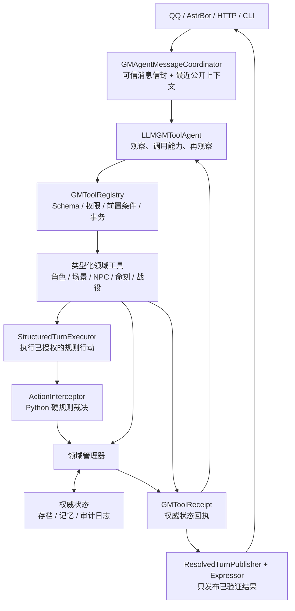

# FU-GM 框架

`FU-GM` 是一个面向《最终物语》的 AI GM 项目，围绕下面这条原则构建：

`Python 负责规则与算数；LLM 负责决策与叙事。`

## 架构图



项目借鉴 Concordia 的实体-组件与“观察、决策、环境裁决”分工，但不依赖或复制 Concordia 代码。生产主流程是：

1. `LLMGMToolAgent` 阅读原始消息、最近公开聊天和权威状态，自主选择静默、自然回复或类型化工具。
2. `GMToolRegistry` 校验 schema、权限和规则前置条件，并在事务中执行领域工具。
3. 规则行动经 `StructuredTurnExecutor` 与 `ActionInterceptor` 结算；成功工具回执是状态变化的唯一依据。
4. 回复层只发布成功回执支持的结果，不能把失败、提议或尝试改写成既成事实。

项目不保留另一套自然语言路由或兼容动作脑。核心 GM 模型不可用时，本轮失败关闭且不写状态，不会退回关键词逻辑或第二个语义裁判。

## 真实运行示例

下面片段摘自 2026-08-06 的 `gpt-5.6-terra` 真实 API 长测，不是手写演示文案；仅把测试账号名替换成了角色名。该批次完成 74 个桌面轮次，180 次模型调用全部成功，且没有失败工具回执。

运行同一套卡里巴村首场长测：

```bash
python scripts/run_kariba_first_session.py \
  --provider terra \
  --model gpt-5.6-terra \
  --max-turns 90
```

```text
诺艾尔：嗯，进入第一章吧。

时悠：暴雨穿过卡里巴村监狱拱顶的裂缝，落进地下牢区的积水。诺艾尔与艾丽妮之间的石墙正渗出细如发丝的蓝白藤丝……雨声压住了上层的脚步声。你们此刻怎么做？

诺艾尔：没急着跨出牢门，先看清门锁、走廊和值守动静，也摸了摸自己身上还剩什么。

时悠：需要进行【洞察+敏捷】检定，难度等级 10。要投吗？如果失败，诺艾尔的试探会碰响铁栅，值班室里的人将循声查看。

诺艾尔：投。

时悠：掷骰 d8=7 + d8=7 = 14；修正值 +0；结算值 14 对抗难度等级 10，成功！大成功！这次大成功还带来一个机会。你想把它用在揭示、进展、纽带、优势或转折上？

诺艾尔：我把这次大成功的机会用于【优势】，目标是【诺艾尔】。

时悠：机会【优势】：诺艾尔的下一次相关检定获得 +4 修正。
```

原始日志保存在不会提交的 `outputs/` 目录；仓库只保留可审阅的[三模型长测报告](docs/kariba_three_model_comparison_2026-08-06.md)与[运行脚本](scripts/run_kariba_first_session.py)。

## 主要组件

- `RulesEngine`：掷骰、检定、伤害与相性结算。
- `CharacterManager`：管理 PC、NPC、HP/MP、物语点、物资点和羁绊。
- `ClockManager`：管理《最终物语》的进度命刻。
- `ConflictManager`：管理冲突场景、回合权和敌方终结点。
- `SceneManager`：管理普通场景、插曲场景、GM 场景、旅行场景和地下城场景。
- `ChapterManager`：管理章节结算、阶段经验、奖励发放与世界变化总结。
- `RestManager`：执行休息恢复、魔法帐篷 IP 消耗与休息推进威胁命刻。
- `SafetyManager`：管理界限与帷幕，支持游戏前或游戏中随时声明并写回世界状态。
- `RitualManager`：管理仪式魔法的效力、范围、MP、DL、冲突仪式命刻与最终检定。
- `ProjectManager`：管理造物使项目/发明的成本、缺陷、材料抵扣、帮手与每日进度。
- `TinkererGadgetManager`：管理造物使便携装置、炼金装置、注魔装置、魔导装置与基础库存道具。
- `EconomyManager`：管理商店购买、库存补充、旅馆/旅行服务、交通工具购买、宝箱、地下城奖励、稀有物品与阶段奖励。
- `EquipmentEffectManager`：把稀有装备文本效果落地为角色派生状态，例如异常免疫、伤害相性、命中/施法修正、多重攻击和命中附加异常。
- `TriggerManager`：统一处理装备、技能与未来神器的时机触发效果，例如大成功/大失败、命中后恢复、击倒奖励、濒死保命和旅行发现。
- `EncounterManager`：根据队伍等级/人数设计遭遇预算，并把小兵升阶为精英或悍将。
- `AdventureEventManager`：根据地点、地形、阵营、旧记忆和 GM 私密暗线生成旅行/地下城上下文事件模板。
- `WorldMapManager`：管理世界地图地点、坐标、地形威胁、路线规划和旅行中发现的新地点。
- `TravelManager`：按地图距离、交通工具、拥有交通工具校验和旅行日结算威胁骰、危险/发现类型与旅行花费；具体旅途画面通过硬结算摘要和 LLM 创意提示交给 GM 发挥。
- `DungeonManager`：管理地下城探索模式、区域地图、房间事件、陷阱、宝箱、区域奖励、危险命刻与 Boss 房。
- `SessionLogManager`：归档每场跑团的完整对话 JSONL，调用 LLM 或离线兜底整理公开故事记忆，并把结果写回长期记忆供水群召回。
- `StoryArcManager`：长期故事节奏器，根据第零章共创档案和每场总结追踪战役阶段、故事线、反派压力、揭示候选、地点回访和下一场议程。
- `TopicMemoryStore`：文件级 Markdown 长期记忆层，读时只扫描 frontmatter 摘要，按公开/私密分层主动召回少量相关记忆，便于人工审计、修订和删除。
- `SessionZeroManager`：管理 Session 0 世界创建档案、八大支柱、小队原型、角色草稿、反派映照、多人轮询与界限/帷幕。
- `CharacterCreationManager`：把 Session 0 产物推进到 5 级起始 PC、小队表与世界表。
- `SheetExporter`：把世界表、小队表、角色表导出为玩家可读 Markdown 和机器可读 JSON。
- `ProgressionManager`：管理阶段经验、升级、职业等级、职业精通与英雄技能。
- `WorldState`：记录世界支柱、地点、关系、Session 0 产物和长期记忆。
- `NPCPersona / NPC 库`：为登场 NPC 保存稳定 ID、公开身份、动机、目标、秘密、关系、当前情绪/立场、口吻示例和带场景来源的记忆；场景参与者、直接问答和敌方行动都会自动补建档案，存档后可再次调用。
- `NPCDirector`：只决定敌人与首领这一回合“做什么”。它看到完整 NPC 档案和当前环境，但只能从 Python 生成的合法动作目录中选择已拥有、可支付的攻击、法术、职业技能、命刻行动或终结点行动。
- `NPCDecisionPlanner`：由核心 GM 在需要 NPC 反应时显式调用；一次返回该 NPC 的行动、公开台词和类型化状态变化建议，不参与消息路由，也不能直接写入权威状态。
- `OpenAICompatibleClient`：统一调用 OpenAI 兼容接口；当遇到 `prompt_too_long`、`413`、`request_too_large` 等可恢复边界错误时，会保留静态 system prompt，对动态消息做最小破坏式折叠并带重试标记自动重试。
- `LLMGMToolAgent`：生产环境唯一的自然语言状态变更规划者；只能通过已注册工具获得能力。
- `GMToolRegistry / GMToolReceipt`：统一工具 schema、前置条件、事务、回滚和权威回执；不再用第二个语义模型复核核心 GM。
- `GMAgentMessageCoordinator`：把 HTTP/AstrBot 信封、最近公开聊天和权威状态组织成一次智能体事务。
- `StructuredTurnExecutor`：把已授权的规则行动送入硬规则，不再重新猜玩家意图。
- `ActionInterceptor`：在叙事前强制执行硬规则；对 `Narrate` 这类软叙事动作只写入记忆和非数值世界变化。
- `Expressor`：把验证后的结果渲染成 JRPG 风格文本。
- `prompt_cache.py`：集中处理缓存友好的 LLM 消息拼装；静态 system prompt 固定在前缀，NPC 人设、GM 人格、记忆和当前场景等动态信息用 `<system-reminder>` 放入消息流，避免频繁击穿供应商的前缀缓存。
- `http_server.py`：FU-GM 轻量 HTTP 服务，给 AstrBot、网页或其他聊天入口调用。
- `optional_rules.py`：管理可选规则开关；所有可选规则默认关闭，只有团桌明确共识后才写入战役状态并进入 GamePanel。
- `equipment_catalog.py`：结构化保存规则书示例稀有武器、防具、盾牌、饰品和神器，供 AI GM 检索参考。
- `gm_guidance.py`：根据第零章共创内容推断 GM 后台灵感标签，检索追问角度、故事节奏和预备地点候选；不让玩家选择扩展或世界类型。
- `prepared_locations/`：结构化保存三本扩展的 30 个示例地点及 10 个通用候选。每个扩展示例包含环境、元素倾向、危险、发现、主题、战役位置、反派用法、可向队伍提出的问题和三个故事引子；内容只在后台检索，成为实际剧情后才写入公开世界状态。
- `play_process_guidance.py`：把核心规则书中的场景、场次与战役结构整理成后台主持流程护栏，供工具智能体、NPC 决策器和 GM 审计面板使用。

## 项目结构

```text
src/fu_gm/
  equipment_catalog.py
  expressor.py
  gm_tool_agent.py
  gm_tool_contracts.py
  gm_tool_execution.py
  http_server.py
  interceptor.py
  llm_client.py
  main.py
  models.py
  play_process_guidance.py
  prompt_cache.py
  scene_orchestrator.py
  spellbook.py
  components/
    adventure_event_manager.py
    character_creation_manager.py
    chapter_manager.py
    character_manager.py
    clock_manager.py
    conflict_manager.py
    dungeon_manager.py
    economy_manager.py
    equipment_effect_manager.py
    encounter_manager.py
    gadget_manager.py
    rest_manager.py
    ritual_manager.py
    rules_engine.py
    safety_manager.py
    scene_manager.py
    session_log_manager.py
    session_zero_manager.py
    sheet_exporter.py
    story_arc_manager.py
    project_manager.py
    progression_manager.py
    travel_manager.py
    trigger_manager.py
    world_map_manager.py
    world_state.py
```

## 快速开始

```bash
python -m venv .venv
source .venv/bin/activate
pip install -e .
fu-gm-demo
```

Windows PowerShell：

```powershell
python -m venv .venv
.\.venv\Scripts\Activate.ps1
pip install -e .
fu-gm-demo
```

如果你不想先安装，也可以直接运行：

```bash
PYTHONPATH=src python3 -m fu_gm.main
```

Windows PowerShell：

```powershell
$env:PYTHONPATH = "src"
python -m fu_gm.main
```

## 交互测试 Session 0

如果你想亲自和 AI GM 对话测试世界创建流程，可以先在 `.env` 中配置真实 LLM：

```env
FU_GM_API_BASE_URL=https://ai-pixel.online
FU_GM_API_KEY=你的密钥
FU_GM_ACTION_MODEL=gpt-5.6-luna
FU_GM_EXPRESSOR_MODEL=gpt-5.6-luna
# 可选：只把最终叙事表达切到另一个 OpenAI 兼容端点。
FU_GM_EXPRESSOR_API_BASE_URL=https://www.moxin.online/v1
FU_GM_EXPRESSOR_API_KEY=你的表达模型密钥
FU_GM_EXPRESSOR_MODEL=claude-opus-4-6
# 核心 GM 负责理解消息、选择工具与最终桌面回应。
FU_GM_CORE_AGENT_ENABLED=1
FU_GM_CORE_GM_MODEL=gpt-5.6-luna
FU_GM_CORE_GM_TIMEOUT_SECONDS=90
# NPC 是核心 GM 显式调用的子智能体，决策与台词在一次事务内生成。
FU_GM_TOOL_AGENT_MODEL=gpt-5.6-luna
```

DeepSeek 也可以直接作为 OpenAI 兼容后端：

```env
FU_GM_API_BASE_URL=https://api.deepseek.com
FU_GM_API_KEY=你的 DeepSeek 密钥
FU_GM_ACTION_MODEL=deepseek-v4-pro
FU_GM_EXPRESSOR_MODEL=deepseek-v4-pro
FU_GM_REASONING_EFFORT=high
FU_GM_THINKING_ENABLED=true

# 结构化规则结算仍可使用独立表达模型；自然消息决策只有核心 GM 一条路径。
FU_GM_ACTION_REASONING_EFFORT=low
FU_GM_ACTION_THINKING=off
FU_GM_EXPRESSOR_API_BASE_URL=https://www.moxin.online/v1
FU_GM_EXPRESSOR_API_KEY=你的表达模型密钥
FU_GM_EXPRESSOR_REASONING_EFFORT=low
FU_GM_EXPRESSOR_THINKING=off
```

如果你觉得 Session 0 对话太慢，建议单独给 Session 0 使用快速配置：

```env
FU_GM_SESSION_ZERO_MODEL=gpt-5.6-luna
FU_GM_SESSION_ZERO_REASONING_EFFORT=low
FU_GM_SESSION_ZERO_THINKING=off
FU_GM_STYLE_FILE=config/gm_styles/acg_highschool_gm.md
```

项目默认附带一份 ACG 女高中生风格的 AI GM 人格文档：`config/gm_styles/acg_highschool_gm.md`。当前默认 GM 名为“时悠”，风格是轻快、宅系、像社团主持人一样会吐槽，但会严格保护界限与帷幕，不泄露 GM 私密暗线。

安装后运行：

```bash
pip install -e .
fu-gm-session-zero --participants 阿凛 白河
```

不安装也可以直接运行模块：

```bash
PYTHONPATH=src python3 -m fu_gm.session_zero_cli --participants 阿凛 白河
```

快速测试可以加 `--fast`，它会沿用当前主模型、降低推理强度并关闭 thinking：

```bash
PYTHONPATH=src python3 -m fu_gm.session_zero_cli --fast --participants 阿凛 白河
```

如果你要让 AI GM 使用一份单独的人格文档：

```bash
PYTHONPATH=src python3 -m fu_gm.session_zero_cli --gm-style-file ./gm_style.md --participants 阿凛 白河
```

默认输出会比较紧凑，只显示 GM 给玩家看的回复和阶段。如果需要调试结构化结果，可以加 `--show-structure`：

```bash
PYTHONPATH=src python3 -m fu_gm.session_zero_cli --show-structure --participants 阿凛 白河
```

Session 0 默认会写入本地 JSONL 日志，路径类似 `logs/session_zero_YYYYMMDD_HHMMSS.jsonl`。也可以指定固定日志：

```bash
PYTHONPATH=src python3 -m fu_gm.session_zero_cli --log-file logs/my_session_zero.jsonl --participants 阿凛 白河
```

DeepSeek V4 的角色扮演思考模式也做成了可选项，默认不注入，避免影响速度：

```bash
PYTHONPATH=src python3 -m fu_gm.session_zero_cli --rp-mode inner_os --participants 阿凛 白河
PYTHONPATH=src python3 -m fu_gm.session_zero_cli --rp-mode analysis --participants 阿凛 白河
```

输入格式是 `玩家名: 发言`，例如：

```text
阿凛: 我想要一个科技奇幻世界，天空被污染云层遮住，但森林里还保留着古老灵魂。
白河: 我不希望出现蜘蛛，儿童遇险请带过。
```

交互中可用命令：

- `/snapshot` 查看当前 Session 0 结构化状态。
- `/summary` 查看当前 Session 0 摘要；这是本地 GM 工具，会包含 GM 私密暗线，别直接贴给玩家。
- `/first-act` 生成或查看第一幕序章候选，并显示当前投票结果。
- `/vote <1|2|3>` 为当前轮询玩家记录第一幕候选投票。
- `/first-act-confirm [1|2|3]` 确认第一幕开局目标；不填编号时会确认当前领先项。
- `/secrets` 查看 GM 私密暗线审计视图；这是主持人专用工具，不应贴给玩家。
- `/missing` 查看还缺哪些世界创建要素。
- `/confirm <草稿名>` 校验并确认角色草稿。
- `/create` 从已确认草稿创建正式 PC。
- `/export <目录>` 导出世界表、小队表和角色表。
- `/save <战役ID>` 保存当前战役记忆。
- `/exit` 退出。

玩家也不必记命令。Session 0 已支持自然语言触发，例如“这个角色可以了”“确认角色”“帮我正式建卡”“创建角色”等，会自动走草稿校验和正式建卡流程。

如果没有配置 API key，或接口不可用，系统会自动使用本地启发式主持器回退；也可以显式加 `--offline` 强制离线测试。

## HTTP 服务与 AstrBot

如果要把 FU-GM 接进 AstrBot，推荐让 FU-GM 独立跑成 HTTP 服务，AstrBot 插件只做消息桥接。

启动 FU-GM 服务：

```bash
PYTHONPATH=src python3 -m fu_gm.http_server --host 127.0.0.1 --port 8765
```

Windows PowerShell：

```powershell
.\scripts\run_fu_gm_http.ps1
```

离线测试服务：

```bash
PYTHONPATH=src python3 -m fu_gm.http_server --offline
```

Windows PowerShell：

```powershell
.\scripts\run_fu_gm_http.ps1 -Offline
```

Windows 上的 AstrBot Launcher 不再使用 `AstrBot.app`。安装桥接插件并注册开机登录自启服务：

```powershell
.\scripts\install_fu_gm_astrbot_launcher.ps1
```

脚本会自动寻找 `%USERPROFILE%\.astrbot_launcher\instances\*\core\data\plugins`，把插件复制到 `fu_gm_bridge`，把 FU-GM 运行时代码复制到 `%USERPROFILE%\.fu-gm`，并创建计划任务 `FU-GM HTTP Server`。如果有多个 AstrBot 实例，可以加 `-InstanceId <实例目录名>`；如果只想复制文件不注册计划任务，可以加 `-NoSchedule`。

常用接口：

- `GET /gm`、`GET /audit` 或 `GET /dashboard`：打开本地 GM 状态/日志审计面板。
- `GET /health`：健康检查。
- `GET /v1/campaigns`：列出磁盘快照和当前内存里的战役。
- `GET /v1/campaigns/current`：查看当前正在跑或最近载入的战役。
- `GET /v1/audit/dashboard`：返回审计 JSON，可传 `campaign_id`、`session_id`、`channel_id`、`limit`、`include_private=true`。
- `GET /v1/campaigns/{campaign_id}/save-slots`：列出某个战役的命名存档槽。
- `POST /v1/campaigns/new`：新建一个空战役快照，并将其设为当前战役。
- `POST /v1/campaigns/save`：保存指定 `campaign_id` 的最新快照；可传 `slot` 生成命名存档。
- `POST /v1/campaigns/load`：读取指定 `campaign_id` 的最新快照；可传 `slot` 读取命名存档。
- `POST /v1/campaigns/delete`：删除最新快照或命名存档槽；传 `delete_all=true` 且 `confirm="确认删除"` 时删除整个战役目录。
- `POST /v1/chat`：统一聊天入口，支持 `mode=casual|game|session_zero|auto`。
- `POST /v1/message/route`：自然群聊仲裁入口，返回 `fu_gm`、`astrbot` 或 `silent`，用于决定是否由 FU-GM 接话。
- `POST /v1/game/turn`：强制走跑团规则回合。
- `POST /v1/session-zero/start`：开始 Session 0。
- `POST /v1/session-zero/message`：推进 Session 0。
- `POST /v1/session/end`：结束并整理本场，生成 `transcript.jsonl`、人类可读的 `transcript.txt`、`story_summary.json` 和 `story_memory.md`，并自动保存最新快照。
- `POST /v1/session/away`：标记玩家临时离席，并自动保存快照。
- `POST /v1/session/back`：标记玩家回到本场，并自动保存快照。
- `POST /v1/session/status`：查看当前团、场景、行动者与离席状态。
- `POST /v1/session/gate`：查看或手动切换某个群/会话是否由 FU-GM 接管。

同一个 `campaign_id` 会对应同一个本地战役目录。FU-GM 服务重启后，只要再次使用同名 `campaign_id`，会自动载入最近的 `snapshot.json`；命名存档则保存在该战役目录下的 `saves/` 中。

本地审计面板默认隐藏 GM 私密暗线；只有在本机勾选“显示私密 GM 内容”或请求 `include_private=true` 时才会返回私密字段。面板会显示 GM 创作指导，包括灵感标签、追问角度、故事节奏、角色创建追问，以及预备地点候选的“后台候选/已公开”状态。面板的“运行监控”区会显示 FU-GM 服务启动时间、运行时长、最近 AstrBot 桥接消息、HTTP 慢请求、核心 GM/规则层/NPC 子智能体/Expressor 的耗时，以及各 LLM 客户端最近调用耗时。不要把这个页面暴露给玩家或公网。
审计面板会自动列出已保存/已载入的战役，并默认每 5 秒刷新一次；如果 URL 没有指定 `campaign_id`，面板会默认打开当前正在跑或最近载入的战役。你也可以在面板顶部切换任意战役、选择命名存档槽，并通过按钮新建战役、保存最新快照、新建命名存档或读取选中存档。如果你在 QQ 里跑的团不是 `default`，也可以直接访问 `/dashboard?campaign_id=团名&session_id=群号`。

AstrBot 薄插件位于 `integrations/astrbot/fu_gm_bridge/`。在 AstrBot Launcher 里，实际安装目录是 `C:\Users\<用户名>\.astrbot_launcher\instances\<实例ID>\core\data\plugins\fu_gm_bridge`。它负责接收群消息、调用 FU-GM HTTP 服务、把回复发回群里。默认命令：

- `/fugm <行动>` 跑团回合。
- `/fugm_chat <内容>` 普通水群，会召回公开故事记忆。
- `/fugm_s0 <内容>` Session 0 讨论。
- `/fugm_end [标题]` 结束并整理本场。
- `/fugm_campaign [团名]` 查看或切换当前群绑定的团。
- `/fugm_campaigns` 列出 FU-GM 服务已知团。
- `/fugm_save [存档槽]` 保存当前团；不填存档槽则保存为最新快照。
- `/fugm_load [团名] [存档槽]` 读档；不填参数则读取当前群绑定团的最新快照。
- `/fugm_delete_save [存档槽]` 删除当前团的最新快照或指定命名存档槽；不填存档槽时只删除最新快照。
- `/fugm_delete_campaign 确认删除` 删除当前群绑定的整个战役目录，包括日志、故事记忆、最新快照和所有命名存档。
- `/fugm_away [原因]` 标记自己临时离席，并自动保存。
- `/fugm_back` 标记自己回到本场，并自动保存。
- `/fugm_status` 查看当前团、场景、行动者和离席状态。
- `/fugm_health` 检查服务。

命令不是主要交互方式，只是备用入口。插件默认启用“会话门控 + 自然消息仲裁”：未开团时，普通群聊会放行给 AstrBot 本体；当群里出现“开始跑团”“今晚开团”“开始最终物语”等明确准备开团信号后，同一群/会话会先进入“开团前共识”阶段，由时悠引导大家对齐基调、主题、队伍关系、界限与帷幕；玩家明确说“开启第零章”或“开始世界创建”后，才会切换到第零章。若是“继续上次冒险”“恢复跑团”这类信号，则会直接进入冒险会话。

FU-GM 接管期间，玩家可以直接说“我攻击宝箱王”“时悠，还记得上次宝箱王吗？”；插件会判断是跑团行动、GM 水群还是静默记录。像“我们要不要先调查宝箱？”这类玩家间讨论会默认静默并写入本场 transcript，避免 GM 和 AstrBot 本体抢话；普通吐槽则由 FU-GM 的水群人格回答，以便使用公开冒险记忆。出现“先暂停一下”“暂停跑团”会保存并暂停，出现“今天到这”“收团”会整理日志、写入故事记忆并关闭接管。

插件默认会对开团后的自然群聊做短延迟合并，避免玩家连续发几句就触发多次 LLM 调用。合并后的 payload 会带 `batch_messages`，FU-GM 服务端会逐条查看原始发言来判断是正式行动、第零章贡献、开团前共识、GM 水群，还是仅需静默记录的桌边讨论。

跑团接管期间，存档/读档也支持自然说法，不必每次输入命令。例如“时悠，调出存档列表”“保存一下”“新建存档 Boss 战前”“读取存档 Boss 战前”。如果只说“读档”但没有指定槽位，GM 会先列出可用存档，避免误读。

## LLM 接入

项目已经接入 OpenAI 兼容风格的聊天补全接口，默认从工作区根目录的 `.env` 读取配置：

```env
FU_GM_API_BASE_URL=https://ai-pixel.online
FU_GM_API_KEY=你的密钥
FU_GM_ACTION_MODEL=gpt-5.6-luna
FU_GM_EXPRESSOR_MODEL=gpt-5.6-luna
```

运行时逻辑如下：

- `LLMGMToolAgent` 直接决定“静默 / 交给 AstrBot / 回复 / 调用一个或多个工具”。
- 规则层只校验结构、归属、前置条件与数值合法性；校验失败会把类型化错误回执交还核心 GM 修正，不再调用第二个 LLM 审计。
- `GMToolRegistry` 为每个写操作建立事务，失败回执自动回滚；只有成功回执能支持公开状态主张。
- 规则工具通过 `StructuredTurnExecutor` 与 `ActionInterceptor` 继续结算掷骰、伤害、资源和回合。
- 明确的 NPC 问答由核心 GM 显式调用 `NPCDecisionPlanner`；下级智能体一次生成行动、公开台词和类型化状态建议，随后仍由工具事务验证和提交。
- 如果核心 GM 或下级 NPC 模型不可用，系统会安全停止本轮并留下诊断，不会回退到关键词动作器继续修改状态。

## 示例展示了什么

仓库内置了一个战斗回合示例：

- 玩家声明使用雷电攻击。
- 工具智能体会选择 `perform_check_action`、`perform_character_action`、`perform_ritual_project_action` 等类型化入口；工具再生成正式规则动作。
- `ActionInterceptor` 调用 `RulesEngine`、`ConflictManager` 与 `TriggerManager` 执行硬规则、反应窗口与条件触发。
- `Expressor` 把正确结果转成 GM 对外播报文本。

## 可扩展点

- 扩展新的类型化 GM 工具及其 schema、前置条件和事务回执，而不是追加关键词特判。
- 让核心 GM 通过统一工具协议调用更多规则与世界组件。
- 增加 `WeatherComponent`、`SceneToneComponent` 之类的新组件。
- 把 `CampaignMemoryStore` 从本地 JSON 后端替换成 SQLite、Mem0、Graphiti 或其他混合记忆后端。
- 把 `SessionLogManager` 挂到 AstrBot/HTTP 消息入口：水群时召回公开故事摘要，开团时写入完整 transcript，收团后自动整理本场故事。

## 当前已实现的硬规则

- 双属性检定、修正值、默认 DL 体系。
- 大成功与大失败判定，以及“机会”计数。
- 大失败自动给予 1 点物语点。
- 高值伤害结算与伤害相性。
- 危机状态自动按 `当前 HP < 最大 HP / 2` 计算。
- 异常状态对属性骰的降级，最低降到 `d6`。
- 团队检定、支援加值与羁绊强度加成。
- 对抗检定平局重掷。
- 命刻按成功/失败幅度推进；大成功/大失败只在机会被用于“进展”时额外影响 2 格。
- GM 可用 `AdvanceClock` 建立或推进目标、威胁、地下城、反派阴谋、Boss 机制等命刻。
- 冲突中的异常状态施加、清除与属性骰联动。
- 反派终结点用于保命逃脱或解除异常并恢复 50 MP。
- Boss 在 0 HP 时可进入升格阶段，刷新终结点并切换战斗状态。
- PC 在 0 HP 时可选择牺牲自己或放弃抵抗并承受剧情代价。
- 逃跑、投降、倒下和牺牲的单位会从回合顺序中移除。
- 攻击、施法、防御、妨碍、调查、推进目标已接入正式动作结算。
- 通用持续效果系统已接入，支持持续到场景结束、施法者下回合开始、本轮结束等时机。
- 结构化法术数据表已接入，当前已支持攻击、治疗、清状态、状态免疫、属性强化、武器附魔、驱散、保命与额外动作等法术效果。
- 元素使、熵术士、御魂使的首批高频法术已接入规则层，例如 `治愈术`、`屏障`、`护卫灵气`、`加速术`、`驱散魔法`、`魂能武器`、`黑暗武器`、`激怒`、`幻觉`、`怠惰` 等。
- 场景推进系统已接入，支持普通、插曲、GM、休息、旅行、地下城与冲突场景的当前状态和历史记录。
- 休息系统已接入，支持定居点/野外休息、魔法帐篷消耗 4 IP、PC 全恢复与休息时推进威胁命刻。
- 世界地图系统已接入，支持地点坐标、地形威胁等级、路线规划、交通工具倍率、旅行费用估算、相关旧记忆召回，以及旅行发现新地点后写回地图。时悠还可以按玩家的自然语言请求查看、生成或重画 Nortantis 世界地图；同一句话包含新地点时，会先提交设定再绘图，并把图片交给聊天桥接层发送。
- 冒险事件模板第一版已接入，旅行危险/发现会根据地形、阵营、地点记忆与 GM 暗线生成上下文模板；地下城房间会根据地点背景、阵营痕迹、旧记忆和 Boss/宝箱/挑战类型生成房间事件。
- 旅行系统已接入，支持地图距离、交通工具倍率、拥有交通工具校验、旅行服务花费、旅行日威胁骰、路线记录，并结算危险、发现或平安通过；旅行日结果会同时给出 `hard_rule_summary` 和 `llm_narrative_prompt`，避免 Python 把奇遇写死。
- 地下城系统已接入，支持场景化/详细/略过探索模式、区域地图、入口/通道/挑战/宝箱/安全点/Boss 房、房间事件运行器、区域奖励字段，以及失败推进危险命刻；探索结果会同时给出 `hard_rule_summary` 和 `llm_narrative_prompt`，让 LLM 负责房间氛围、线索和转折表现。
- 地下城设计辅助已接入，支持按“重要性/是否预设”推荐探索模式、使用地下城生成表生成概念/焦点/栖息者/特异点、创建危险命刻，并给出“不要预设唯一解法”“奖励分散布置”等 GM 准则。
- 遭遇设计辅助已接入，支持按队伍等级、玩家人数与简单/普通/困难/Boss 难度计算小兵等效数量、推荐敌人等级范围、估算单次敌方伤害，并可把敌人模板升阶为精英或悍将，自动调整 HP/MP/先攻/每轮行动次数。
- NPC 设计辅助已接入，支持按物种、等级、属性分配、弱点、阶级和装备修正生成 NPC 数值草案；内置野兽、构装体、恶魔、元素、人型、怪物、植物、不死族的物种规则，以及 NPC 技能、NPC 法术、调查信息阈值和战斗透明提示。它们是给 GM/LLM 参考的数值骨架，不会限制敌人的外观、招式名称或剧情定位。
- 战斗机制参考库已接入，包含有意义战斗原则、资源消耗节奏、等级关系提示、守卫、限制条件、相性变化、波次、增援、元素光环、危险升级、陷阱灾害、不稳定区域、蓄力攻击、固定模式、多阶段和可选多部件 Boss 等素材；LLM 应按场景选择一两个合适机制，而不是全部堆叠。
- Boss 阶段素材第一版已接入，支持过载暴走、封闭核心、多部件裂解、相性反转等可选骨架；它们是给 GM/LLM 改写的战术素材，不会默认把每个 Boss 都设计成多部件。升格时可刷新终结点、改变相性、调整行动次数、追加能力/法术，并把阶段偏好动作与战术提示交给 NPCAct。
- 仪式系统第一版已接入，支持效力/范围计算 MP 和 DL、稀有材料减半、禁用直接伤害/状态/资源等违规效果、冲突仪式命刻、最终仪式检定与 MP 消耗；`PlanRitual`、`ContributeRitual`、`CastRitual` 已接入 LLM Action 自动路由，成功仪式可写回世界事实或地点设施。
- 项目/发明系统第一版已接入，支持造物使发起项目、效力/范围/用途计算成本、缺陷降低 25% 成本、材料抵扣、先见之明、雇佣帮手与每日进度完成；`StartProject`、`HireProjectHelpers`、`WorkProject` 已接入 LLM Action 自动路由，完成项目可持久化为世界事实、地点设施、角色装备或一次性道具。
- Session 0 世界创建流程已接入，支持 AI GM 开场、讨论推进、玩家轮询、八大支柱建档、小队原型、地点/阵营/反派种子/谜团/界限与帷幕写入 `WorldState`。
- Session 0 支持真实 LLM 主持器与本地启发式回退，AI GM 会以共同创作者身份提出建议，而不是机械问卷式执行规则。
- Session 0 已接入默认 GM 人格“时悠”，可通过 `FU_GM_STYLE_FILE` 或 `--gm-style-file` 替换；CLI 默认使用紧凑回复，并把完整交互写入本地 JSONL 日志。
- Session 0 角色草稿已接入，玩家不必一次想完完整角色；AI GM 可从自然语言中逐步更新名字、身份、主题、起源、职业、属性、技能、法术、装备、羁绊和背景笔记，并提醒缺失关键项。
- Session 0 世界设定支持增删，玩家可以在讨论中取消地点、阵营、谜团或角色草稿条目；公开的“反派映照原则”会进入世界表，GM 私密暗线会保存在 `gm_secret_notes`，不会导出到玩家世界表。
- Session 0 角色草稿到正式角色创建闭环已接入，支持草稿校验、缺项/错误/警告报告、玩家确认后正式建卡、批量创建已确认草稿，以及“确认角色/正式建卡”等自然语言意图触发。
- Session 0 第一幕序章流程已接入，支持按小队主题生成多个第一幕候选、多人投票、确认开局目标，并把已选第一幕写入世界档案和长期记忆。
- GM 私密暗线审计视图已接入，支持检查结构化暗线、旧式私密笔记、公开线索缺口、关联实体缺口与已公开事实锁定风险，帮助 GM 保持暗线可玩但不提前泄露。
- 角色创建闭环已接入，支持起始 5 级、标准 2 到 3 个职业与本桌 GM 通融 4 职业特例、总职业等级 5、每级 1 个职业技能、授法技能追问对应法术、重复技能上限、属性骰校验、职业免费增益、起始 3 物语点，并生成 `PartySheet` 与 `WorldSheet`。
- 起始装备购买已接入，支持 500Z 预算、基础武器/防具/盾牌表、职业限定装备权限校验、装备防御/魔防/先攻修正、主手/副手占用、剩余预算加 `2d6 x 10` 命运馈赠后得到初始泽尼特。
- 角色表/小队表/世界表导出已接入，支持 Markdown 文本、JSON 载荷和本地文件写入，方便后续接 QQ 群或 GM 面板。
- 世界表导出已包含仪式造成的长期变化、发明资产和地点设施，方便玩家回顾“世界被怎样改变了”。
- 可选规则开关第一版已接入，`以代价换成功`、`以援用换失败`、`偷袭轮`、`冲突外玩家重掷`、`战斗制霸`、`奇能`、`零界力量`、`营地活动`、`科技灵球`、`载具级冲突` 等均默认关闭；只有玩家明确同意时才记录为启用，并会显示在审计面板和运行时上下文中。
- 界限与帷幕已接入运行期管理，玩家可在 Session 0 或游戏中随时用自然语言声明，例如“我不希望出现蜘蛛”“儿童遇险请带过”；系统只确认处理方式，不追问原因，并把 guidance 传给核心 GM、NPC 子智能体与 Expressor。
- 长期记忆检索已接入实体抽取，核心 GM 与 NPC 子智能体会优先召回旧 NPC、地点、羁绊、公开历史和 GM 私密暗线；Expressor 仍只接收公开记忆，避免把暗线直接说给玩家。
- 章节结算已接入，支持阶段经验、升级资格、阶段奖励、宝藏发放和世界变化总结，并会把结算结果写入长期记忆。
- 跑团日志整理已接入，`SessionLogManager` 会保存完整对话 `transcript.jsonl`，并同步维护便于人工阅读的 `transcript.txt`；在每场结束时调用 `LLMStorySummarizer` 或离线兜底整理公开故事总结、短记忆、时间线、奖励、悬念与 GM 私密备注；公开短记忆会写回 `WorldState` 和 `TopicMemoryStore`，供之后水群闲聊时召回，私密备注只写入私密主题记忆，不会进入公开召回。场次尚未结束时，水群回顾和游戏回合会注入最近 transcript 的公开内容，避免“收团前失忆”。
- 冒险中的世界观补全已接入：如果第零章没有完全共创完成，FU-GM 不会强制倒回第零章，而会在跑团过程中通过自然追问、地点描写、NPC线索或玩家回答继续补全；当这些内容成为公开事实时，核心 GM 会通过类型化世界状态工具写入世界风貌、地点、势力、奥秘、威胁和反派种子。
- 轻量 HTTP 服务已接入，支持健康检查、统一聊天、跑团回合、Session 0、结束整理等接口；AstrBot 薄插件模板已接入 `integrations/astrbot/fu_gm_bridge/`，用于把群消息转发到 FU-GM 服务。
- 长期记忆第二版已接入：`WorldState` 继续保存权威结构化事实，`CampaignMemoryStore` 保存 `snapshot.json` 和 `events.jsonl`，`TopicMemoryStore` 额外把故事摘要、NPC/地点/暗线等写成可审计 Markdown 主题记忆。构建核心 GM 上下文时会先按 frontmatter 低成本扫描，再只读取少量相关正文；核心 GM 与 NPC 子智能体可看到履职所需的公开记忆和 GM 私密记忆，Expressor 与水群闲聊只接收公开记忆，避免暗线提前泄露。
- `Narrate` 软叙事即时主题记忆已接入：LLM 临场创造的公开事实、对象事实、NPC 更新、关系、非数值持久变化和 GM 私密暗线会在本轮结束时写入公开/私密 Markdown 记忆，下一轮即可召回；数值、资源、命刻和装备合法性仍只能由硬规则动作结算。
- 经验/升级系统第一版已接入，支持阶段经验结算、终结点奖励、物语点均分、10 XP 升级、每阶段最多升 1 级、20/40 级属性提升、职业 10 级精通与英雄技能选择。
- 首批成长效果已接入规则层，包括职业免费增益、近战/远程武器精通、猛力打击/强力射击/强效法术、额外生命值/精神值/物资点、免于异常、深藏不露、防御精通与坚不可摧；其中防御精通会按规则检查盾牌或职业限定防具，装备换皮时也以数值模板为准。
- 职业/英雄技能动作路由第一版已接入，`Skill` 动作会统一校验角色是否拥有该技能，并结算暗影击、摧心重击、挑衅、谴责、鼓舞、窃取时间、窃取灵魂、回见了您呐、碎骨、威慑射击、破防打击、挺身守护、快速评估、意外盟友、缴械雄辩、不出所料！、影逝、重燃希望、火山、彗星等技能。
- 技能触发点系统已接入第二批，`SkillTriggerManager` 统一处理确定性被动/触发：怒焰斗士【肾上腺素】、英雄技能【强效法术/猛力打击/强力射击】的伤害加成，博学家【知识就是力量】的开放检定修正，游说家【巧舌如簧】和英雄技能【奥灵共鸣】的命刻额外格，以及拟兽使【摄能为食】的施法伤害后恢复 MP。仪表盘会展示这些自动触发器，方便审计哪些规则由 Python 落地、哪些仍交给 GM/LLM 判断。
- 多目标攻击已接入，`Attack` 可使用 `targets` 数组以一次命中检定分别对比多个目标防御并逐个结算伤害；`弹幕射击` 与 `利刃风暴` 已接入该通道。
- 反应窗口第一版已接入，攻击动作可携带 `reactions` 声明；当前支持 `干涉火力` 在远程攻击伤害前消耗 MP 令攻击自动失败，以及 `反击` 在近战攻击后以 HR 视为 0 进行反击。
- 完整冲突轮转第一版已接入，支持 `NextTurn` 推进当前行动者、奖励/额外行动队列、轮末时机，以及精英/悍将/Boss 每轮多行动；规则层会同步输出回合面板和最近战斗日志，让群聊里更容易看清谁已行动、谁还没行动。
- 奥灵使奥灵第一版已接入，支持 `契约与召唤` 召唤/遣散熔炉、寒霜、门径、魔典、橡树、天空、剑、高塔、轮等奥灵，并把融合抗性、状态免疫、防御/属性强化、剑之奥灵无类型攻击、遣散伤害/治疗/传送/神谕等效果交由规则层处理。
- 造物使便携装置第一版已接入，支持 `UseInventory` 结算治疗剂、圣灵水、万能药、元素裂片；`TinkererGadget` 结算炼金装置 d20 目标/效果、魔法加农炮、魔导覆写、法球；攻击动作可通过 `infusion_name` 触发注魔装置，自动扣 IP、改写伤害类型并追加猛毒中毒。
- 装备/经济/奖励第一版已接入，支持 `Shop` 购买基础装备/道具、补充库存点、购买旅馆服务、雇佣旅行服务、购买长期交通工具并写入世界资产、职业限定装备权限校验和装备后防御重算；`OpenChest` 可发放金币、普通道具和稀有物品并写入长期资产；`AwardReward` 已按队伍最高等级和玩家人数使用奖励预算表发放阶段宝藏；稀有武器、防具、盾牌和饰品的品质设计器已接入第一版；宝箱、阶段奖励和地下城奖励配置都会给出硬结算摘要与 LLM 创意提示，让奖励故事不被随机表写死。
- 地下城奖励自动分配第一版已接入，`EconomyManager.plan_dungeon_rewards` 会按队伍等级/人数的奖励预算把金币、普通道具或稀有装备分散写入宝箱房与 Boss 房；玩家用 `ExploreDungeon` 取得区域宝藏时会自动调用宝箱奖励结算。
- 规则书示例装备数据库已接入，包含 113 件稀有武器、22 件稀有防具、12 面稀有盾牌、29 件饰品和 11 件神器；经济系统可查询这些物品价格、作为宝箱固定奖励并写入长期资产。
- 装备效果自动落地第一版已接入，装备稀有武器/防具/盾牌/饰品时会自动刷新角色的武器公式、防御/魔防/先攻、异常免疫、伤害相性、命中/施法/伤害/治疗加值、攻击改打魔防、无视抵抗/相性、多重攻击标记和命中附加异常；攻击、施法、固定伤害和异常施加会读取这些派生效果。
- 通用触发器第一版已接入，支持大成功/大失败、命中后恢复 HP/MP/IP、击倒后恢复 IP、攻击性法术命中施加异常、HP 归零前保留 1 HP、旅行发现获得物语点等装备触发；触发结果会进入规则文本与 payload，方便 Expressor 描述。
- 尚依赖专门子系统的技能已被识别并预留，例如长期装备改造；当前会返回“已识别但待建模”，不会让 LLM 直接绕过规则层改数值。
- 完整冒险烟测已接入，覆盖 Session 0 第一幕确认、建 PC、地图旅行、地下城生成、宝箱奖励、Boss 升格/投降、世界持久变化、章节结算与升级资格，作为“能跑完一章”的最低回归保护。

## 说明

这个骨架刻意让面向 LLM 的模块保持可替换、可模拟，这样你后续接 OpenAI 或其他模型服务时，不需要重写规则核心。

