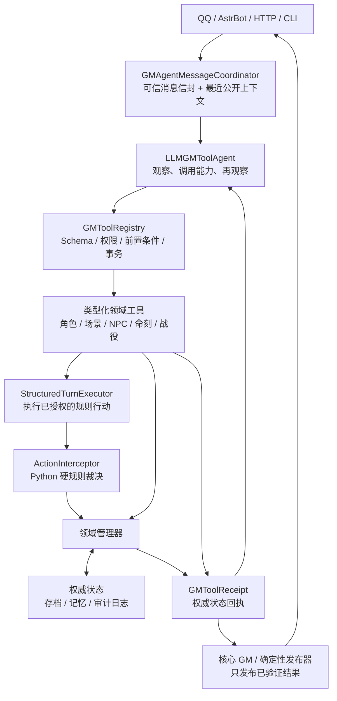
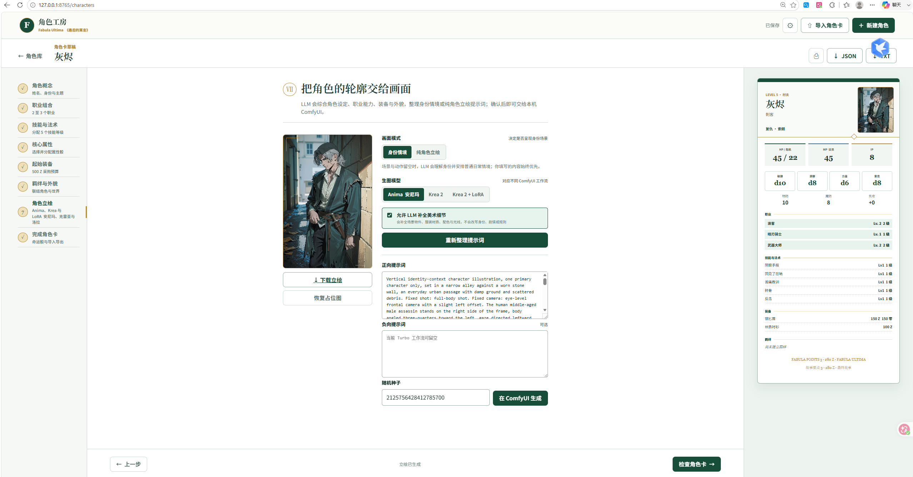

# FU-GM 框架

`FU-GM` 是一个面向《最终物语》的 AI GM 项目，围绕下面这条原则构建：

`Python 负责规则与算数；LLM 负责决策与叙事。`

> **非官方与 AI 内容声明**
>
> FU-GM 是 cunfu 的独立制作，与 Need Games 或 Rooster Games 无关。本项目依据
> [Fabula Ultima Third-Party Tabletop License 1.0](https://need.games/wp-content/uploads/2024/06/Fabula-Ultima-Third-Party-Tabletop-License-1.0.pdf)
> 发布，并需要《最终物语》官方核心规则书才能完整使用。《最终物语》由
> Emanuele Galletto 创作、Need Games 出版，版权归 Need Games 和 Rooster Games
> 所有。本仓库包含生成式 AI 辅助创作的代码、文档、测试对话、提示词和视觉素材；
> 运行时内容也可能由用户配置的 AI 服务生成。完整权利边界见
> [LICENSE](LICENSE) 与 [THIRD_PARTY_NOTICES.md](THIRD_PARTY_NOTICES.md)。

## 架构图



项目借鉴 Concordia 的实体-组件与“观察、决策、环境裁决”分工，但不依赖或复制 Concordia 代码。生产主流程是：

1. `LLMGMToolAgent` 阅读原始消息、最近公开聊天和权威状态，自主选择静默、自然回复或类型化工具。
2. `GMToolRegistry` 校验 schema、权限和规则前置条件，并在事务中执行领域工具。
3. 规则行动经 `StructuredTurnExecutor` 与 `ActionInterceptor` 结算；成功工具回执是状态变化的唯一依据。
4. 核心 GM 在同一结构化循环里形成普通最终回复；锁定的规则或专项创作结果由确定性发布器送达。两者都只能发布成功回执支持的事实。

项目不保留另一套自然语言路由或兼容动作脑。核心 GM 模型不可用时，本轮失败关闭且不写状态，不会退回关键词逻辑或第二个语义裁判。

核心循环、上下文治理、工具执行元数据、群聊投递闸门、长期记忆生命周期与
NPC侧链的具体边界见[Agent Harness 架构说明](docs/gm_agent_harness_architecture_2026-08-11.md)。

## 真实运行记录

下面内容来自 **2026-08-18 的一次真实 QQ 群跑团**：两名真人玩家与由
`DeepSeek-V4-Flash-0731` 驱动的 AI GM“时悠”共同完成第零章、角色创建和第一章
开场。这不是 FU-PL 生成的自动化长测，也不是为 README 另写的演示台词。

公开版本已删除逐条消息时间、玩家昵称、QQ号、群号及其他可关联个人的元数据；
玩家统一记为“玩家甲”和“玩家乙”。下面依次节选三个阶段，完整记录入口放在片段之后。

### 角色创建

```text
玩家甲：我先做角色。名字叫灰烬，身份是刺客。

时悠：这个“刺客”怎么看待自己？受雇杀人的职业人、背叛组织的逃亡者，还是把暗杀当成复仇手段的人？

玩家甲：索朗秘密机关培养出来的刺客，已经叛逃。他不觉得杀人光荣，只是暂时还不会用别的方法活下去。

玩家乙：我的叫伊大石。身份有点长：原魔法学院厨师，跟随大魔导师学艺后放弃厨师生涯。主题我想自定义成守护。

时悠：伊大石最想守住什么？又会在什么情况下，为了守护主动离开安全的位置？

玩家乙：他觉得有本事的人应该站在危险和普通人中间。以前只想安稳做饭，师傅失踪后才发现一直躲着也保护不了任何东西。

玩家乙：装备两面符文盾和青铜板甲，但两面符文盾都改名叫大黑锅。外观真的是锅，规则完全按符文盾走，可以吗？

时悠：可以。它们占盾牌栏位、价格和效果都按符文盾，不会因为能炒菜额外加伤害。
```

### 第一章：战斗前

```text
时悠：黄昏把边境路照成一条发暗的铜带。

你们与商队分别还不到半个钟头，前方就传来马匹痛苦的嘶鸣。一辆没有旗号的信使车侧翻在路中央；一名车夫被压在车辕下，仍然活着。

四名索朗巡兵占住道路西侧，三名自由城邦斥候守在东侧。七个人谁都没有先救车夫，因为双方都认定是对方袭击了这辆车。

玩家甲：灰烬先不回答，压低声音问伊大石：“七个全盯着旗子，没人看伤员。你救人，我看看车？”

玩家乙：“行。真打起来就往我后面站。”伊大石把两口锅从背后卸下来，但先没有举起，免得他们以为我们要开打。

玩家乙：伊大石对两边的人说：“先让一下。你们谁的事都可以晚半刻钟办，人的腿不能。”然后走去抬车辕。

时悠：车辕很沉，但还没重到需要伊大石赌运气。他蹲下肩膀一顶，变形的木梁便从车夫腿上抬开。莉娜最先反应过来，拖着车夫离开车轮；索朗的一名年轻巡兵也过来帮忙。
```

### 第一章：战斗

```text
时悠：一头比马矮半头的灰烬兽撞破沟边土壁。更小的灰影紧随其后扑向两支巡逻队，最大的那头越过所有持械者，直奔信使车里的铜匣。

进入冲突场景。

玩家甲：团队先攻我来领，伊大石协助？

玩家乙：可以，我帮你看它从哪边冲。

时悠：灰烬负责抓住开战时机，伊大石协助。敏捷d10掷出6，洞察d8掷出7，协助+1，结算值14。灰烬兽一方先攻11，英雄方先行动。

玩家甲：我先。灰烬趁它只盯着铜匣，从侧面冲过去，用钢匕首刺它后腿关节。

时悠：灰烬以钢匕首攻击灰烬兽：结算值14，对抗物防10，命中。匕首沿黑晶接缝刺入，造成12点物理伤害。

玩家乙：用挺身守护，我替车夫承受。

时悠：伊大石横移一步，右手大黑锅先把车夫完全遮住。灰烬兽撞击伊大石：结算值13，对抗伊大石物防15，未命中。

第一轮结束。它胸腔里的光正在失控，热浪已经让铜匣表面的雨水开始沸腾。

【灰烬核心过热】1/4
```

### 完整对话

以上仅为节选。可继续阅读[匿名化后的完整运行记录](docs/real_runs/2026-08-18_deepseek-v4-flash-0731_full-transcript.txt)。

### 自动化回归

真实跑团之外，仓库仍保留可重复执行的[三模型长测报告](docs/kariba_three_model_comparison_2026-08-06.md)与[首场运行脚本](scripts/run_kariba_first_session.py)。20 场框架测试默认使用 `--player-mode natural`：每条公开消息会同时交给所有 FU-PL，各自决定发言或等待，测试框架不指定下一位说话者；稳定覆盖全部规则时改用 `--player-mode coverage`。两种模式的边界、成本和报告指标见 [FU-PL 自然桌运行方式](docs/fu_pl_natural_table_architecture.md)。

## 主要组件

- `RulesEngine`：掷骰、检定、伤害与相性结算。
- `CharacterManager`：管理 PC、NPC、HP/MP、物语点、物资点和羁绊。
- `ClockManager`：管理《最终物语》的进度命刻。
- `ConflictManager`：管理冲突场景、回合权和敌方终结点。
- `SceneManager`：管理普通场景、插曲场景、GM 场景、旅行场景和地下城场景。
- `ChapterManager`：管理章节结算、阶段经验、奖励发放与世界变化总结。
- `RestManager`：执行休息恢复、魔法帐篷 IP 消耗与休息推进威胁命刻。
- `SafetyManager`：管理界限与帷幕，支持游戏前或游戏中随时声明并写回世界状态。
- `RitualManager`：管理仪式魔法的效力、范围、MP、DL、冲突仪式命刻与最终检定。
- `ProjectManager`：管理造物使项目/发明的成本、缺陷、材料抵扣、帮手与每日进度。
- `TinkererGadgetManager`：管理造物使便携装置、炼金装置、注魔装置、魔导装置与基础库存道具。
- `EconomyManager`：管理商店购买、库存补充、旅馆/旅行服务、交通工具购买、宝箱、地下城奖励、稀有物品与阶段奖励。
- `EquipmentEffectManager`：把稀有装备文本效果落地为角色派生状态，例如异常免疫、伤害相性、命中/施法修正、多重攻击和命中附加异常。
- `TriggerManager`：统一处理装备、技能与未来神器的时机触发效果，例如大成功/大失败、命中后恢复、击倒奖励、濒死保命和旅行发现。
- `EncounterManager`：根据队伍等级/人数设计遭遇预算，并把小兵升阶为精英或悍将。
- `AdventureEventManager`：根据地点、地形、阵营、旧记忆和 GM 私密暗线生成旅行/地下城上下文事件模板。
- `WorldMapManager`：管理世界地图地点、坐标、地形威胁、路线规划和旅行中发现的新地点。
- `TravelManager`：按地图距离、交通工具、拥有交通工具校验和旅行日结算威胁骰、危险/发现类型与旅行花费；具体旅途画面通过硬结算摘要和 LLM 创意提示交给 GM 发挥。
- `DungeonManager`：管理地下城探索模式、区域地图、房间事件、陷阱、宝箱、区域奖励、危险命刻与 Boss 房。
- `SessionLogManager`：归档每场跑团的完整对话 JSONL，调用 LLM 或离线兜底整理公开故事记忆，并把结果写回长期记忆供水群召回。
- `StoryArcManager`：长期故事节奏器，根据第零章共创档案和每场总结追踪战役阶段、故事线、反派压力、揭示候选、地点回访和下一场议程。
- `TopicMemoryStore`：文件级 Markdown 长期记忆层，读时只扫描 frontmatter 摘要，按公开/私密分层主动召回少量相关记忆，便于人工审计、修订和删除。
- `SessionZeroManager`：管理 Session 0 世界创建档案、八大支柱、小队原型、角色草稿、反派映照、多人轮询与界限/帷幕。
- `CharacterCreationManager`：把 Session 0 产物推进到 5 级起始 PC、小队表与世界表。
- `SheetExporter`：把世界表、小队表、角色表导出为玩家可读 Markdown 和机器可读 JSON。
- `ProgressionManager`：管理阶段经验、升级、职业等级、职业精通与英雄技能。
- `WorldState`：记录世界支柱、地点、关系、Session 0 产物和长期记忆。
- `NPCPersona / NPC 库`：为登场 NPC 保存稳定 ID、公开身份、动机、目标、秘密、关系、当前情绪/立场、口吻示例和带场景来源的记忆；场景参与者、直接问答和敌方行动都会自动补建档案，存档后可再次调用。
- `NPCCombatRules / NPCTurnExecutor`：Python 生成合法动作目录并结算敌人与首领已经选择的攻击、法术、技能、命刻行动或终结点行动；核心 GM 决定 NPC 做什么，规则层不靠关键词替它改选行动。
- `NPCVoiceRenderer`：核心 GM 先用结构化内容条目决定 NPC 的立场、事实、拒绝、条件和承诺；专用声线模型只改变角色口吻。事实性答复会由核心模型做只读一致性审计，任一环节失败都回退到核心 GM 已通过工具审计的安全文本。声线器不能写入世界状态。
- `SceneCreativeWriter`：使用独立 DeepSeek 创作路由编写场次准备、GM 暗线、场景开场与转场、普通环境回应、NPC 登场与战斗起手、命刻氛围文字和场景/冲突/场次收束。核心 GM 只选工具、人物、地点、目标与已授权事实；Python 仍掌管骰子、格数、合法动作、参与者、泄密检查和原子写入。生产环境中创作模型失败时不让核心 GM 偷偷补写成品，该事务保持未提交并可重试。
- `OpenAICompatibleClient`：统一调用 OpenAI 兼容接口；当遇到 `prompt_too_long`、`413`、`request_too_large` 等可恢复边界错误时，会保留静态 system prompt，对动态消息做最小破坏式折叠并带重试标记自动重试。
- `LLMGMToolAgent`：生产环境唯一的自然语言状态变更规划者；只能通过已注册工具获得能力。
- `GMAgentLoopState`：集中记录单轮阶段、耗时、迭代次数与终止原因，不复制权威游戏状态。
- `GMContextGovernor`：在模型调用前主动执行工具结果预算、最近消息尾窗、历史微压缩和结构化上下文折叠，并保护当前回合与待决规则状态。
- `GMToolRegistry / GMToolReceipt`：统一工具 schema、前置条件、事务、回滚和权威回执。核心 GM 仍是唯一语义决策者；NPC 声线审计只能拒绝不忠实的表达候选，不能提出行动或写入状态。
- `GMAgentMessageCoordinator`：把 HTTP/AstrBot 信封、最近公开聊天和权威状态组织成一次智能体事务。
- `StructuredTurnExecutor`：把已授权的规则行动送入硬规则，不再重新猜玩家意图。
- `ActionInterceptor`：在叙事前强制执行硬规则；对 `Narrate` 这类软叙事动作只写入记忆和非数值世界变化。
- `Expressor`：保留规则结果的确定性排版和显式兼容回滚模式。普通 GM 回复默认由核心循环直接写成最终文本，不再追加一次外层模型改写；NPC 直答仍由受约束的独立声线器处理。
- `AdventureOpeningPrefetcher`：第一章邀请成功提交后，在后台用脱离实时状态的副本准备私密场次契约；只把带精确指纹的缓存包写入存档，不会提前开章、建场景或注册 NPC。玩家同意时，`start_adventure` 在一个可回滚事务里完成开章和首场，省去第二轮核心工具决策。
- `GMBackgroundDelegationManager`：承接真正需要多轮工具调用的长任务。核心 GM 先自然确认受理，玩家可以继续聊天；后台执行器每轮只规划并提交一个工具步骤，随即释放战役锁并在下一轮重读最新状态。任务、回执、等待问题和通知都会持久化，服务重启后可恢复。
- `prompt_cache.py`：集中处理缓存友好的 LLM 消息拼装；静态 system prompt 固定在前缀，NPC 人设、GM 人格、记忆和当前场景等动态信息用 `<system-reminder>` 放入消息流，避免频繁击穿供应商的前缀缓存。
- `ChannelTurnGate`：在 AstrBot 侧按频道串行覆盖后端提交、QQ发送和送达确认，避免回复与下一条消息交叉成两条时间线。
- `http_server.py`：FU-GM 轻量 HTTP 服务，给 AstrBot、网页或其他聊天入口调用。
- `optional_rules.py`：管理可选规则开关；所有可选规则默认关闭，只有团桌明确共识后才写入战役状态并进入 GamePanel。
- `equipment_catalog.py`：结构化保存规则书示例稀有武器、防具、盾牌、饰品和神器，供 AI GM 检索参考。
- `gm_guidance.py`：根据第零章共创内容推断 GM 后台灵感标签，检索追问角度、故事节奏和预备地点候选；不让玩家选择扩展或世界类型。
- `prepared_locations/`：结构化保存三本扩展的 30 个示例地点及 10 个通用候选。每个扩展示例包含环境、元素倾向、危险、发现、主题、战役位置、反派用法、可向队伍提出的问题和三个故事引子；内容只在后台检索，成为实际剧情后才写入公开世界状态。
- `play_process_guidance.py`：把核心规则书中的场景、场次与战役结构整理成后台主持流程护栏，供工具智能体、NPC 决策器和 GM 审计面板使用。

## 项目结构

```text
src/fu_gm/
  equipment_catalog.py
  expressor.py
  gm_tool_agent.py
  gm_tool_contracts.py
  gm_tool_execution.py
  http_server.py
  interceptor.py
  llm_client.py
  models.py
  play_process_guidance.py
  prompt_cache.py
  scene_orchestrator.py
  spellbook.py
  components/
    adventure_event_manager.py
    character_creation_manager.py
    chapter_manager.py
    character_manager.py
    clock_manager.py
    conflict_manager.py
    dungeon_manager.py
    economy_manager.py
    equipment_effect_manager.py
    encounter_manager.py
    gadget_manager.py
    rest_manager.py
    ritual_manager.py
    rules_engine.py
    safety_manager.py
    scene_manager.py
    session_log_manager.py
    session_zero_manager.py
    sheet_exporter.py
    story_arc_manager.py
    project_manager.py
    progression_manager.py
    travel_manager.py
    trigger_manager.py
    world_map_manager.py
    world_state.py
```

## 快速开始

要求 Python 3.9 或更高版本。当前发行方式是“源码检出 + editable install”；默认人格、OFL 字体、Nortantis 和 AstrBot 插件不在 wheel 内，运行地图或桥接功能时请保留完整仓库目录。

```bash
python -m venv .venv
source .venv/bin/activate
pip install -e .
fu-gm-server --host 127.0.0.1 --port 8765 --offline
```

Windows PowerShell：

```powershell
python -m venv .venv
.\.venv\Scripts\Activate.ps1
pip install -e .
fu-gm-server --host 127.0.0.1 --port 8765 --offline
```

开发和完整测试请安装 test extra：

```bash
pip install -e ".[test]"
PYTHONPATH=src python -m pytest -q -p no:cacheprovider
```

Windows PowerShell：

```powershell
pip install -e ".[test]"
$env:PYTHONPATH = "src;."
python -m pytest -q -p no:cacheprovider
```

模型配置可从无密钥模板开始：

```bash
cp .env.example .env
```

`.env` 当前只保证简单的 `KEY=value`，不要写 `export`、命令替换或 shell 表达式。真实密钥只放在被 Git 忽略的 `.env`，不要写进 README、脚本或探针产物。

如果你不想先安装，也可以直接运行：

```bash
PYTHONPATH=src python3 -m fu_gm.http_server --host 127.0.0.1 --port 8765 --offline
```

Windows PowerShell：

```powershell
$env:PYTHONPATH = "src"
python -m fu_gm.http_server --host 127.0.0.1 --port 8765 --offline
```

### 角色工房已迁移到独立仓库

Fabula Ultima 角色工房现已独立维护：
[cunFu-ai/Fabula-Ultima-Character-Workshop](https://github.com/cunFu-ai/Fabula-Ultima-Character-Workshop)。
不需要 Python 的 Windows 版本可从
[v0.1.0 Release](https://github.com/cunFu-ai/Fabula-Ultima-Character-Workshop/releases/tag/v0.1.0)
下载。FU-GM 当前仍保留兼容快照与旧入口，避免既有安装和测试中断；角色工房后续功能、
修复与发行均以独立仓库为准。

启动后可在浏览器打开 `http://127.0.0.1:8765/characters` 使用角色工房。网页会按
《最终物语》（Fabula Ultima）简中核心规则 1.03 校验 5 级起始角色。完成的角色卡
保存在角色工房自己的 `data/character-workshop/roster.json`，不会写入 FU-GM 战役、
队伍卡或世界记忆；尚未完成的草稿只保存在当前浏览器。进阶角色卡加入本地名册时
会保留完整快照；载入网页编辑器则会明确创建新的 5 级副本，避免误改成长数据。

### Fabula Ultima 角色工房效果



导入 JSON 时，角色工房会先检查文件大小、JSON 结构、角色卡版本、规则集与角色数值，
然后展示冲突和警告。你可以只载入编辑，也可以选择停止、覆盖或作为副本加入本地名册。
旧版 `fu-gm.character-card` 文件仍可读取，并会在导入时转换为
`fabula-ultima.character-card`；扩展字段会原样保留。

Windows 用户也可以直接双击项目根目录的 `启动角色工房.cmd`。入口会检查
`127.0.0.1:8765`，在需要时于后台启动独立的角色工房服务，然后打开网页；重复双击不会
重复启动服务。启动日志保存在 `logs/character-workshop.out.log` 和
`logs/character-workshop.err.log`。

要制作不需要 Python 环境的 Windows 本地发行包，先安装打包依赖，再运行构建脚本：

```powershell
python -m pip install -e ".[package]"
powershell -ExecutionPolicy Bypass -File scripts\build_character_workshop.ps1
```

成品位于 `release/character-workshop/`。朋友完整解压 ZIP 后，只需双击
`Fabula-Ultima-Character-Workshop.exe`；程序会打开浏览器，并通过一个小型控制窗口管理
本地服务。便携发行模式只监听 `127.0.0.1`，不读取项目 `.env`，也不开放 GM 接口。
角色名册保存在当前 Windows 用户的本地应用数据目录。

角色工房也可以为 Anima、Krea 2 或 Krea 2 + LoRA 整理立绘提示词。网页右上角的生成设置
可以填写本机 ComfyUI 端口、OpenAI 兼容 LLM 接口、模型与 API Key。端口、接口地址和模型
会保存，API Key 仅保留在本次进程内存中，关闭后自动清除。发行 ZIP 会附带 `workflows`
文件夹中的现有 API-format 工作流；也可按[工作流配置说明](config/comfyui_workflows/README.md)
替换同名 JSON。未连接 ComfyUI 不影响建卡和角色卡导入导出。

## 交互测试 Session 0

如果你想亲自和 AI GM 对话测试世界创建流程，可以复制 `.env.example`，并至少填入下面这些配置：

```env
FU_GM_API_BASE_URL=https://api.deepseek.com
FU_GM_API_KEY=你的DeepSeek密钥
FU_GM_ACTION_MODEL=deepseek-v4-flash-vision-exp
FU_GM_EXPRESSOR_MODEL=deepseek-v4-flash-vision-exp
FU_GM_THINKING_ENABLED=false
FU_GM_ACTION_THINKING=off
FU_GM_EXPRESSOR_THINKING=off

# 核心 GM 负责理解消息、选择工具与最终桌面回应。
FU_GM_CORE_AGENT_ENABLED=1
FU_GM_CORE_GM_MODEL=deepseek-v4-flash-vision-exp
FU_GM_TOOL_AGENT_MODEL=deepseek-v4-flash-vision-exp
FU_GM_TOOL_PROTOCOL_REPAIR_MODEL=deepseek-v4-flash-vision-exp
FU_GM_REPLY_GROUNDING_MODEL=deepseek-v4-flash-vision-exp
FU_GM_CORE_GM_TIMEOUT_SECONDS=90
FU_GM_CORE_GM_THINKING=off
FU_GM_PUBLIC_EXPRESSION_MODE=core
FU_GM_EXPRESSOR_RULE_RESULT_PROSE_ENABLED=0
FU_GM_ADVENTURE_OPENING_FLOW_MODE=optimized
FU_GM_ADVENTURE_OPENING_PREFETCH_TIMEOUT_SECONDS=65
FU_GM_CAPABILITY_ROUTING_MODE=intent
FU_GM_STATE_CONTEXT_MODE=summary_delta

# NPC立场由核心 GM 决定，声线器只改变说话口吻。
FU_GM_NPC_VOICE_ENABLED=1
FU_GM_NPC_VOICE_MODEL=deepseek-v4-flash-vision-exp
FU_GM_NPC_VOICE_API_BASE_URL=https://api.deepseek.com
FU_GM_NPC_VOICE_THINKING=off
# off / high_risk / all；默认关闭额外模型复核以降低延迟。
FU_GM_NPC_VOICE_AUDIT_MODE=off

# 场次暗线、开场、转场和收束使用同一官方 DeepSeek 路由。
FU_GM_CREATIVE_MODEL=deepseek-v4-flash-vision-exp
FU_GM_CREATIVE_API_BASE_URL=https://api.deepseek.com
FU_GM_CREATIVE_THINKING=off

# 官方密钥不能被带到第三方备用端点。
FU_GM_BACKUP_API_BASE_URLS=
```

当前主线把所有语言职责锁定到官方实验模型 `deepseek-v4-flash-vision-exp`，并关闭 Thinking。FU-GM 使用 `/chat/completions`、JSON Output 和工具调用，不依赖 FIM 补全。结构化 JSON 偶发空正文时只在同一截止时间内恢复一次，第二次请求取消 `response_format`，随后明确失败或进入受控本地兜底，不做无界重试。

Session 0 也沿用同一快速模型：

```env
FU_GM_SESSION_ZERO_MODEL=deepseek-v4-flash-vision-exp
FU_GM_SESSION_ZERO_THINKING=off
FU_GM_STYLE_FILE=config/gm_styles/acg_highschool_gm.md
```

项目默认附带一份 ACG 女高中生风格的 AI GM 人格文档：`config/gm_styles/acg_highschool_gm.md`。当前默认 GM 名为“时悠”，风格是轻快、宅系、像社团主持人一样会吐槽，但会严格保护界限与帷幕，不泄露 GM 私密暗线。

安装后运行：

```bash
pip install -e .
fu-gm-session-zero --participants 阿凛 白河
```

不安装也可以直接运行模块：

```bash
PYTHONPATH=src python3 -m fu_gm.session_zero_cli --participants 阿凛 白河
```

快速测试可以加 `--fast`，它会沿用当前主模型、降低推理强度并关闭 thinking：

```bash
PYTHONPATH=src python3 -m fu_gm.session_zero_cli --fast --participants 阿凛 白河
```

如果你要让 AI GM 使用一份单独的人格文档：

```bash
PYTHONPATH=src python3 -m fu_gm.session_zero_cli --gm-style-file ./gm_style.md --participants 阿凛 白河
```

默认输出会比较紧凑，只显示 GM 给玩家看的回复和阶段。如果需要调试结构化结果，可以加 `--show-structure`：

```bash
PYTHONPATH=src python3 -m fu_gm.session_zero_cli --show-structure --participants 阿凛 白河
```

Session 0 默认会写入本地 JSONL 日志，路径类似 `logs/session_zero_YYYYMMDD_HHMMSS.jsonl`。也可以指定固定日志：

```bash
PYTHONPATH=src python3 -m fu_gm.session_zero_cli --log-file logs/my_session_zero.jsonl --participants 阿凛 白河
```

DeepSeek V4 的角色扮演思考模式也做成了可选项，默认不注入，避免影响速度：

```bash
PYTHONPATH=src python3 -m fu_gm.session_zero_cli --rp-mode inner_os --participants 阿凛 白河
PYTHONPATH=src python3 -m fu_gm.session_zero_cli --rp-mode analysis --participants 阿凛 白河
```

输入格式是 `玩家名: 发言`，例如：

```text
阿凛: 我想要一个科技奇幻世界，天空被污染云层遮住，但森林里还保留着古老灵魂。
白河: 我不希望出现蜘蛛，儿童遇险请带过。
```

交互中可用命令：

- `/snapshot` 查看当前 Session 0 结构化状态。
- `/summary` 查看当前 Session 0 摘要；这是本地 GM 工具，会包含 GM 私密暗线，别直接贴给玩家。
- `/first-act` 生成或查看第一幕序章候选，并显示当前投票结果。
- `/vote <1|2|3>` 为当前轮询玩家记录第一幕候选投票。
- `/first-act-confirm [1|2|3]` 确认第一幕开局目标；不填编号时会确认当前领先项。
- `/secrets` 查看 GM 私密暗线审计视图；这是主持人专用工具，不应贴给玩家。
- `/missing` 查看还缺哪些世界创建要素。
- `/confirm <草稿名>` 校验并确认角色草稿。
- `/create` 从已确认草稿创建正式 PC。
- `/export <目录>` 导出世界表、小队表和角色表。
- `/save <战役ID>` 保存当前战役记忆。
- `/exit` 退出。

玩家也不必记命令。Session 0 已支持自然语言触发，例如“这个角色可以了”“确认角色”“帮我正式建卡”“创建角色”等，会自动走草稿校验和正式建卡流程。

Session 0 自然语言 CLI 必须配置可用的 LLM。没有 API key、模型不可用或调用失败时会失败关闭，不会用启发式主持器冒充成功；`fu-gm-session-zero` 也没有 `--offline` 参数。离线环境仍可运行 Python 硬规则、类型化工具和单元测试。

## HTTP 服务与 AstrBot

如果要把 FU-GM 接进 AstrBot，推荐让 FU-GM 独立跑成 HTTP 服务，AstrBot 插件只做消息桥接。

### macOS 一键启动

在 Finder 中双击仓库根目录的 `start_fu_gm.command`，它会自动：

- 使用当前仓库源码和仓库内的 `.venv`（没有时使用系统 Python 3）；
- 检查 Python 3.9+、端口占用和 `/health`；
- 启动 FU-GM，并在就绪后打开本地 Dashboard；
- 检测已有 FU-GM 实例，避免重复启动。

也可以在终端执行同一个入口：

```bash
./start_fu_gm.command
```

新启动的服务由这个终端托管，按 `Ctrl+C` 或关闭终端即可停止。若服务原本已由 LaunchAgent 启动，一键入口只会打开 Dashboard，不会停止或替换现有服务。离线验证可执行：

```bash
FU_GM_OFFLINE=1 ./start_fu_gm.command
```

出于安全考虑，一键入口只接受 `127.0.0.1` 或 `localhost`，不会把无鉴权接口开放到局域网。它只启动 FU-GM 核心服务，不会自动启动或安装 AstrBot。

启动 FU-GM 服务：

```bash
PYTHONPATH=src python3 -m fu_gm.http_server --host 127.0.0.1 --port 8765
```

Windows PowerShell：

```powershell
.\scripts\run_fu_gm_http.ps1
```

通用 Python 服务默认端口是 `8765`；Windows AstrBot 安装器和 `run_fu_gm_http.ps1` 默认使用 `8766`，安装器会把同一端口同步写入插件配置。两种端口都可以使用，但服务与插件的 `server_url` 必须一致。

离线测试服务：

```bash
PYTHONPATH=src python3 -m fu_gm.http_server --offline
```

Windows PowerShell：

```powershell
.\scripts\run_fu_gm_http.ps1 -Offline
```

Windows 上的 AstrBot Launcher 不再使用 `AstrBot.app`。安装桥接插件并注册开机登录自启服务：

```powershell
.\scripts\install_fu_gm_astrbot_launcher.ps1
```

脚本默认在项目内寻找 `<项目根目录>\.runtime\.astrbot_launcher\instances\*\core\data\plugins`，把插件复制到 `fu_gm_bridge`，把 FU-GM 运行时代码复制到 `<项目根目录>\.runtime\.fu-gm`，并创建计划任务 `FU-GM HTTP Server`。如果有多个 AstrBot 实例，可以加 `-InstanceId <实例目录名>`；若 Launcher 或运行时在别处，分别传 `-LauncherDataRoot`、`-RuntimeHome`。如果只想复制文件不注册计划任务，可以加 `-NoSchedule`。

常用接口：

- `GET /gm`、`GET /audit` 或 `GET /dashboard`：打开本地 GM 状态/日志审计面板。
- `GET /health`：健康检查。
- `GET /v1/campaigns`：列出磁盘快照和当前内存里的战役。
- `GET /v1/campaigns/current`：查看当前正在跑或最近载入的战役。
- `GET /v1/audit/dashboard`：返回审计 JSON，可传 `campaign_id`、`session_id`、`channel_id`、`limit`、`include_private=true`。
- `GET /v1/campaigns/{campaign_id}/save-slots`：列出某个战役的命名存档槽。
- `POST /v1/campaigns/new`：新建一个空战役快照，并将其设为当前战役。
- `POST /v1/campaigns/save`：保存指定 `campaign_id` 的最新快照；可传 `slot` 生成命名存档。
- `POST /v1/campaigns/load`：读取指定 `campaign_id` 的最新快照；可传 `slot` 读取命名存档。
- `POST /v1/campaigns/delete`：删除最新快照或命名存档槽；传 `delete_all=true` 且 `confirm="确认删除"` 时删除整个战役目录。
- `POST /v1/chat`：统一聊天入口，支持 `mode=casual|game|session_zero|auto`。
- `POST /v1/message/route`：自然群聊仲裁入口，返回 `fu_gm`、`astrbot` 或 `silent`，用于决定是否由 FU-GM 接话。
- `POST /v1/game/turn`：强制走跑团规则回合。
- `POST /v1/session-zero/start`：开始 Session 0。
- `POST /v1/session-zero/message`：推进 Session 0。
- `POST /v1/session/end`：结束并整理本场，生成 `transcript.jsonl`、人类可读的 `transcript.txt`、`story_summary.json` 和 `story_memory.md`，并自动保存最新快照。
- `POST /v1/session/away`：标记玩家临时离席，并自动保存快照。
- `POST /v1/session/back`：标记玩家回到本场，并自动保存快照。
- `POST /v1/session/status`：查看当前团、场景、行动者与离席状态。
- `POST /v1/session/gate`：查看或手动切换某个群/会话是否由 FU-GM 接管。

同一个 `campaign_id` 会对应同一个本地战役目录。FU-GM 服务重启后，只要再次使用同名 `campaign_id`，会自动载入最近的 `snapshot.json`；命名存档则保存在该战役目录下的 `saves/` 中。

本地审计面板默认隐藏 GM 私密暗线；只有在本机勾选“显示私密 GM 内容”或请求 `include_private=true` 时才会返回私密字段。面板会显示 GM 创作指导，包括灵感标签、追问角度、故事节奏、角色创建追问，以及预备地点候选的“后台候选/已公开”状态。面板的“运行监控”区会显示 FU-GM 服务启动时间、运行时长、最近 AstrBot 桥接消息、HTTP 慢请求、核心 GM/规则层/NPC 子智能体/Expressor 的耗时，以及各 LLM 客户端最近调用耗时。不要把这个页面暴露给玩家或公网。
审计面板会自动列出已保存/已载入的战役，并默认每 5 秒刷新一次；如果 URL 没有指定 `campaign_id`，面板会默认打开当前正在跑或最近载入的战役。你也可以在面板顶部切换任意战役、选择命名存档槽，并通过按钮新建战役、保存最新快照、新建命名存档或读取选中存档。如果你在 QQ 里跑的团不是 `default`，也可以直接访问 `/dashboard?campaign_id=团名&session_id=群号`。

HTTP 服务目前没有应用层认证，只应监听 `127.0.0.1`。不要直接绑定 `0.0.0.0`、映射公网端口或把 dashboard 放到无认证的反向代理后。所有 POST 必须使用 `Content-Type: application/json`，默认请求体上限为 1 MiB；需要接收更大的导入载荷时可谨慎调整 `FU_GM_HTTP_MAX_BODY_BYTES`。

macOS 的 `scripts/run_fu_gm_http.sh` 已从脚本位置推导源码目录，并支持 `FU_GM_WORKSPACE_DIR`、`FU_GM_RUNTIME_HOME`、`FU_GM_PYTHON` 和 `FU_GM_DATA_ROOT`。但是仓库中的 LaunchAgent 安装脚本和 plist 仍是当前机器部署模板，含绝对路径；换用户名或换目录时不要直接安装，先改成由安装脚本生成当前用户的 plist。

AstrBot 薄插件位于 `integrations/astrbot/fu_gm_bridge/`。按默认安装脚本，实际安装目录是 `<项目根目录>\.runtime\.astrbot_launcher\instances\<实例ID>\core\data\plugins\fu_gm_bridge`。它负责接收群消息、调用 FU-GM HTTP 服务、把回复发回群里。默认命令：

- `/fugm <行动>` 跑团回合。
- `/fugm_chat <内容>` 普通水群，会召回公开故事记忆。
- `/fugm_s0 <内容>` Session 0 讨论。
- `/fugm_end [标题]` 结束并整理本场。
- `/fugm_campaign [团名]` 查看或切换当前群绑定的团。
- `/fugm_campaigns` 列出 FU-GM 服务已知团。
- `/fugm_save [存档槽]` 保存当前团；不填存档槽则保存为最新快照。
- `/fugm_load [团名] [存档槽]` 读档；不填参数则读取当前群绑定团的最新快照。
- `/fugm_delete_save [存档槽]` 删除当前团的最新快照或指定命名存档槽；不填存档槽时只删除最新快照。
- `/fugm_delete_campaign 确认删除` 删除当前群绑定的整个战役目录，包括日志、故事记忆、最新快照和所有命名存档。
- `/fugm_away [原因]` 标记自己临时离席，并自动保存。
- `/fugm_back` 标记自己回到本场，并自动保存。
- `/fugm_status` 查看当前团、场景、行动者和离席状态。
- `/fugm_health` 检查服务。

命令不是主要交互方式，只是备用入口。插件默认启用“会话门控 + 自然消息仲裁”：未开团时，普通群聊会放行给 AstrBot 本体；当群里出现“开始跑团”“今晚开团”“开始最终物语”等明确准备开团信号后，同一群/会话会先进入“开团前共识”阶段，由时悠引导大家对齐基调、主题、队伍关系、界限与帷幕；玩家明确说“开启第零章”或“开始世界创建”后，才会切换到第零章。若是“继续上次冒险”“恢复跑团”这类信号，则会直接进入冒险会话。

FU-GM 接管期间，玩家可以直接说“我攻击宝箱王”“时悠，还记得上次宝箱王吗？”；插件会判断是跑团行动、GM 水群还是静默记录。像“我们要不要先调查宝箱？”这类玩家间讨论会默认静默并写入本场 transcript，避免 GM 和 AstrBot 本体抢话；普通吐槽则由 FU-GM 的水群人格回答，以便使用公开冒险记忆。出现“先暂停一下”“暂停跑团”会保存并暂停，出现“今天到这”“收团”会整理日志、写入故事记忆并关闭接管。

需要整理多份规则、补全多项世界资料或在幕后准备一组 NPC 时，可以直接让时悠“放到后台做，好了告诉我们”。受理后主对话不会等待整项工作完成；时悠仍能继续回应群聊。玩家也可以自然询问后台进度、取消本人发起的任务，或回答后台提出的必要问题。完成、失败或需要补充信息时，AstrBot 会向原群聊或原私聊发送一条独立通知；这条通知不依赖剧情心跳，也不会推进场景或替角色行动。当前地图图片渲染仍使用地图专用流程，因为渲染器尚未采用脱离实时状态的快照提交，不能安全包装成通用后台任务。

插件默认会对开团后的自然群聊做短延迟合并，避免玩家连续发几句就触发多次 LLM 调用。合并后的 payload 会带 `batch_messages`，FU-GM 服务端会逐条查看原始发言来判断是正式行动、第零章贡献、开团前共识、GM 水群，还是仅需静默记录的桌边讨论。

跑团接管期间，存档/读档也支持自然说法，不必每次输入命令。例如“时悠，调出存档列表”“保存一下”“新建存档 Boss 战前”“读取存档 Boss 战前”。如果只说“读档”但没有指定槽位，GM 会先列出可用存档，避免误读。

## LLM 接入

项目已经接入 OpenAI 兼容风格的聊天补全接口，默认从工作区根目录的 `.env` 读取配置；主线配置以官方 DeepSeek 为唯一语言模型端点：

```env
FU_GM_API_BASE_URL=https://api.deepseek.com
FU_GM_API_KEY=你的密钥
FU_GM_ACTION_MODEL=deepseek-v4-flash-vision-exp
FU_GM_CORE_GM_MODEL=deepseek-v4-flash-vision-exp
FU_GM_TOOL_AGENT_MODEL=deepseek-v4-flash-vision-exp
FU_GM_THINKING_ENABLED=false
FU_GM_PUBLIC_EXPRESSION_MODE=core
```

运行时逻辑如下：

- `LLMGMToolAgent` 直接决定“静默 / 交给 AstrBot / 回复 / 调用一个或多个工具”。
- 能力路由不增加模型调用：Python先从固定意图微包中选出本轮候选Schema，再与阶段策略和注册表取交集。`shadow`只记录候选、保持旧能力面；`intent`才真正裁剪，歧义请求仍保留`discover_capabilities`作为安全扩展入口。
- `summary_delta`把本次Agent事务第一次脱敏后的模型状态作为权威基线；工具执行后由Python对新旧模型投影生成累计`add/replace/remove`，每轮都用哈希重建验证。切换战役、会话、场景、权限视图或超出预算会立即重建基线；规则审校和工具执行始终读取最新运行时状态，不读取旧基线。
- 普通最终回复由核心 GM 在这条循环内直接完成，不再交给外层表达模型二次改写。
- 第一章邀请提交后会异步准备私密场次契约；玩家同意时，核心 GM 调用一次复合 `start_adventure`，由 Python 在同一事务中建立场次与首场。缓存必须通过当前权威输入指纹和质量状态校验，安全边界、世界、角色、参与者、第一幕或提示结构变化都会令旧缓存失效。设置 `FU_GM_ADVENTURE_OPENING_FLOW_MODE=legacy` 可回退到原来的 `start_session`、`start_scene` 两轮链路。
- 场次准备只请求三个可换序机会，主输出预算为 3600 tokens；开场作者与修复稿预算为 2400 tokens，并将公开开场收敛为一段现场画面、一项即时压力和一个开放问题。事实、保密与玩家自主权审校仍然保留。
- NPC 战斗蓝图按完整请求签名持久复用；相同请求严格合并为一个任务，后台默认单 worker，并延后到玩家开场回复关键路径之后再占用模型并发。
- 只复述白名单状态或逐字采用成功工具公开回执时，Python 可以确定性完成最终事实审校；路径、值、固定句式任一不一致，仍回到模型语义审校。
- 规则层校验结构、归属、前置条件与数值合法性；校验失败会把类型化错误回执交还核心 GM 修正。NPC 声线的只读语义审计只检查是否忠实表达已决定内容，不具有决策权或写入权。
- `GMToolRegistry` 为每个写操作建立事务，失败回执自动回滚；只有成功回执能支持公开状态主张。
- 规则工具通过 `StructuredTurnExecutor` 与 `ActionInterceptor` 继续结算掷骰、伤害、资源和回合。
- 明确的 NPC 问答由核心 GM 调用 `decide_npc_response`，先提交结构化公开内容与状态决定；`NPCVoiceRenderer` 随后只为这些内容配音。最终公开文本与后台记忆使用同一个通过校验的版本。
- 如果 NPC 声线或审计模型不可用，系统使用核心 GM 的安全内容完成本轮；如果核心 GM 本身不可用，系统会安全停止并留下诊断，不会回退到关键词动作器继续修改状态。

## 规则行动链路

真实消息中的战斗行动会沿生产链路完成结算：

- 玩家用自然语言声明角色行动。
- 工具智能体会选择 `perform_check_action`、`perform_character_action`、`perform_ritual_project_action` 等类型化入口；工具再生成正式规则动作。
- `ActionInterceptor` 调用 `RulesEngine`、`ConflictManager` 与 `TriggerManager` 执行硬规则、反应窗口与条件触发。
- 核心 GM 根据规则回执形成最终播报；锁定的规则结果由确定性发布器排版后直接送达。

## 可扩展点

- 扩展新的类型化 GM 工具及其 schema、前置条件和事务回执，而不是追加关键词特判。
- 让核心 GM 通过统一工具协议调用更多规则与世界组件。
- 增加 `WeatherComponent`、`SceneToneComponent` 之类的新组件。
- 把 `CampaignMemoryStore` 从本地 JSON 后端替换成 SQLite、Mem0、Graphiti 或其他混合记忆后端。
- 把 `SessionLogManager` 挂到 AstrBot/HTTP 消息入口：水群时召回公开故事摘要，开团时写入完整 transcript，收团后自动整理本场故事。

## 当前已实现的硬规则

- 双属性检定、修正值、默认 DL 体系。
- 大成功与大失败判定，以及“机会”计数。
- 大失败自动给予 1 点物语点。
- 高值伤害结算与伤害相性。
- 危机状态自动按 `当前 HP < 最大 HP / 2` 计算。
- 异常状态对属性骰的降级，最低降到 `d6`。
- 团队检定、支援加值与羁绊强度加成。
- 对抗检定平局重掷。
- 命刻按成功/失败幅度推进；大成功/大失败只在机会被用于“进展”时额外影响 2 格。
- GM 可用 `AdvanceClock` 建立或推进目标、威胁、地下城、反派阴谋、Boss 机制等命刻。
- 冲突中的异常状态施加、清除与属性骰联动。
- 反派终结点用于保命逃脱或解除异常并恢复 50 MP。
- Boss 在 0 HP 时可进入升格阶段，刷新终结点并切换战斗状态。
- PC 在 0 HP 时可选择牺牲自己或放弃抵抗并承受剧情代价。
- 逃跑、投降、倒下和牺牲的单位会从回合顺序中移除。
- 攻击、施法、防御、妨碍、调查、推进目标已接入正式动作结算。
- 通用持续效果系统已接入，支持持续到场景结束、施法者下回合开始、本轮结束等时机。
- 结构化法术数据表已接入，当前已支持攻击、治疗、清状态、状态免疫、属性强化、武器附魔、驱散、保命与额外动作等法术效果。
- 元素使、熵术士、御魂使的首批高频法术已接入规则层，例如 `治愈术`、`屏障`、`护卫灵气`、`加速术`、`驱散魔法`、`魂能武器`、`黑暗武器`、`激怒`、`幻觉`、`怠惰` 等。
- 场景推进系统已接入，支持普通、插曲、GM、休息、旅行、地下城与冲突场景的当前状态和历史记录。
- 休息系统已接入，支持定居点/野外休息、魔法帐篷消耗 4 IP、PC 全恢复与休息时推进威胁命刻。
- 世界地图系统已接入，支持地点坐标、地形威胁等级、路线规划、交通工具倍率、旅行费用估算、相关旧记忆召回，以及旅行发现新地点后写回地图。时悠还可以按玩家的自然语言请求查看、生成或重画 Nortantis 世界地图；同一句话包含新地点时，会先提交设定再绘图，并把图片交给聊天桥接层发送。
- 冒险事件模板第一版已接入，旅行危险/发现会根据地形、阵营、地点记忆与 GM 暗线生成上下文模板；地下城房间会根据地点背景、阵营痕迹、旧记忆和 Boss/宝箱/挑战类型生成房间事件。
- 旅行系统已接入，支持地图距离、交通工具倍率、拥有交通工具校验、旅行服务花费、旅行日威胁骰、路线记录，并结算危险、发现或平安通过；旅行日结果会同时给出 `hard_rule_summary` 和 `llm_narrative_prompt`，避免 Python 把奇遇写死。
- 地下城系统已接入，支持场景化/详细/略过探索模式、区域地图、入口/通道/挑战/宝箱/安全点/Boss 房、房间事件运行器、区域奖励字段，以及失败推进危险命刻；探索结果会同时给出 `hard_rule_summary` 和 `llm_narrative_prompt`，让 LLM 负责房间氛围、线索和转折表现。
- 地下城设计辅助已接入，支持按“重要性/是否预设”推荐探索模式、使用地下城生成表生成概念/焦点/栖息者/特异点、创建危险命刻，并给出“不要预设唯一解法”“奖励分散布置”等 GM 准则。
- 遭遇设计辅助已接入，支持按队伍等级、玩家人数与简单/普通/困难/Boss 难度计算小兵等效数量、推荐敌人等级范围、估算单次敌方伤害，并可把敌人模板升阶为精英或悍将，自动调整 HP/MP/先攻/每轮行动次数。
- NPC 设计辅助已接入，支持按物种、等级、属性分配、弱点、阶级和装备修正生成 NPC 数值草案；内置野兽、构装体、恶魔、元素、人型、怪物、植物、不死族的物种规则，以及 NPC 技能、NPC 法术、调查信息阈值和战斗透明提示。它们是给 GM/LLM 参考的数值骨架，不会限制敌人的外观、招式名称或剧情定位。
- 战斗机制参考库已接入，包含有意义战斗原则、资源消耗节奏、等级关系提示、守卫、限制条件、相性变化、波次、增援、元素光环、危险升级、陷阱灾害、不稳定区域、蓄力攻击、固定模式、多阶段和可选多部件 Boss 等素材；LLM 应按场景选择一两个合适机制，而不是全部堆叠。
- Boss 阶段素材第一版已接入，支持过载暴走、封闭核心、多部件裂解、相性反转等可选骨架；它们是给 GM/LLM 改写的战术素材，不会默认把每个 Boss 都设计成多部件。升格时可刷新终结点、改变相性、调整行动次数、追加能力/法术，并把阶段偏好动作与战术提示交给 NPCAct。
- 仪式系统第一版已接入，支持效力/范围计算 MP 和 DL、稀有材料减半、禁用直接伤害/状态/资源等违规效果、冲突仪式命刻、最终仪式检定与 MP 消耗；`PlanRitual`、`ContributeRitual`、`CastRitual` 已接入 LLM Action 自动路由，成功仪式可写回世界事实或地点设施。
- 项目/发明系统第一版已接入，支持造物使发起项目、效力/范围/用途计算成本、缺陷降低 25% 成本、材料抵扣、先见之明、雇佣帮手与每日进度完成；`StartProject`、`HireProjectHelpers`、`WorkProject` 已接入 LLM Action 自动路由，完成项目可持久化为世界事实、地点设施、角色装备或一次性道具。
- Session 0 世界创建流程已接入，支持 AI GM 开场、讨论推进、玩家轮询、八大支柱建档、小队原型、地点/阵营/反派种子/谜团/界限与帷幕写入 `WorldState`。
- Session 0 支持真实 LLM 主持器，AI GM 会以共同创作者身份提出建议，而不是机械问卷式执行规则；自然语言 CLI 失败关闭，启发式实现只用于离线测试和非权威辅助流程。
- Session 0 已接入默认 GM 人格“时悠”，可通过 `FU_GM_STYLE_FILE` 或 `--gm-style-file` 替换；CLI 默认使用紧凑回复，并把完整交互写入本地 JSONL 日志。
- Session 0 角色草稿已接入，玩家不必一次想完完整角色；AI GM 可从自然语言中逐步更新名字、身份、主题、起源、职业、属性、技能、法术、装备、羁绊和背景笔记，并提醒缺失关键项。
- Session 0 世界设定支持增删，玩家可以在讨论中取消地点、阵营、谜团或角色草稿条目；公开的“反派映照原则”会进入世界表，GM 私密暗线会保存在 `gm_secret_notes`，不会导出到玩家世界表。
- Session 0 角色草稿到正式角色创建闭环已接入，支持草稿校验、缺项/错误/警告报告、玩家确认后正式建卡、批量创建已确认草稿，以及“确认角色/正式建卡”等自然语言意图触发。
- Session 0 第一幕序章流程已接入，支持按小队主题生成多个第一幕候选、多人投票、确认开局目标，并把已选第一幕写入世界档案和长期记忆。
- GM 私密暗线审计视图已接入，支持检查结构化暗线、旧式私密笔记、公开线索缺口、关联实体缺口与已公开事实锁定风险，帮助 GM 保持暗线可玩但不提前泄露。
- 角色创建闭环已接入，支持起始 5 级、标准 2 到 3 个职业与本桌 GM 通融 4 职业特例、总职业等级 5、每级 1 个职业技能、授法技能追问对应法术、重复技能上限、属性骰校验、职业免费增益、起始 3 物语点，并生成 `PartySheet` 与 `WorldSheet`。
- 起始装备购买已接入，支持 500Z 预算、基础武器/防具/盾牌表、职业限定装备权限校验、装备防御/魔防/先攻修正、主手/副手占用、剩余预算加 `2d6 x 10` 命运馈赠后得到初始泽尼特。
- 角色表/小队表/世界表导出已接入，支持 Markdown 文本、JSON 载荷和本地文件写入，方便后续接 QQ 群或 GM 面板。
- 世界表导出已包含仪式造成的长期变化、发明资产和地点设施，方便玩家回顾“世界被怎样改变了”。
- 可选规则开关第一版已接入，`以代价换成功`、`以援用换失败`、`偷袭轮`、`冲突外玩家重掷`、`战斗制霸`、`奇能`、`零界力量`、`营地活动`、`科技灵球`、`载具级冲突` 等均默认关闭；只有玩家明确同意时才记录为启用，并会显示在审计面板和运行时上下文中。
- 界限与帷幕已接入运行期管理，玩家可在 Session 0 或游戏中随时用自然语言声明，例如“我不希望出现蜘蛛”“儿童遇险请带过”；系统只确认处理方式，不追问原因，并把 guidance 传给核心 GM、NPC 子智能体与受约束的公开渲染器。
- 长期记忆检索已接入实体抽取，核心 GM 与 NPC 子智能体会优先召回旧 NPC、地点、羁绊、公开历史和 GM 私密暗线；专项公开渲染器仍只接收公开记忆，避免把暗线直接说给玩家。
- 章节结算已接入，支持阶段经验、升级资格、阶段奖励、宝藏发放和世界变化总结，并会把结算结果写入长期记忆。
- 跑团日志整理已接入，`SessionLogManager` 会保存完整对话 `transcript.jsonl`，并同步维护便于人工阅读的 `transcript.txt`；在每场结束时调用 `LLMStorySummarizer` 或离线兜底整理公开故事总结、短记忆、时间线、奖励、悬念与 GM 私密备注；公开短记忆会写回 `WorldState` 和 `TopicMemoryStore`，供之后水群闲聊时召回，私密备注只写入私密主题记忆，不会进入公开召回。场次尚未结束时，水群回顾和游戏回合会注入最近 transcript 的公开内容，避免“收团前失忆”。
- 冒险中的世界观补全已接入：如果第零章没有完全共创完成，FU-GM 不会强制倒回第零章，而会在跑团过程中通过自然追问、地点描写、NPC线索或玩家回答继续补全；当这些内容成为公开事实时，核心 GM 会通过类型化世界状态工具写入世界风貌、地点、势力、奥秘、威胁和反派种子。
- 轻量 HTTP 服务已接入，支持健康检查、统一聊天、跑团回合、Session 0、结束整理等接口；AstrBot 薄插件模板已接入 `integrations/astrbot/fu_gm_bridge/`，用于把群消息转发到 FU-GM 服务。
- 长期记忆第二版已接入：`WorldState` 继续保存权威结构化事实，`CampaignMemoryStore` 保存 `snapshot.json` 和 `events.jsonl`，`TopicMemoryStore` 额外把故事摘要、NPC/地点/暗线等写成可审计 Markdown 主题记忆。构建核心 GM 上下文时会先按 frontmatter 低成本扫描，再只读取少量相关正文；核心 GM 与 NPC 子智能体可看到履职所需的公开记忆和 GM 私密记忆，专项公开渲染器与水群闲聊只接收公开记忆，避免暗线提前泄露。
- `Narrate` 软叙事即时主题记忆已接入：LLM 临场创造的公开事实、对象事实、NPC 更新、关系、非数值持久变化和 GM 私密暗线会在本轮结束时写入公开/私密 Markdown 记忆，下一轮即可召回；数值、资源、命刻和装备合法性仍只能由硬规则动作结算。
- 经验/升级系统第一版已接入，支持阶段经验结算、终结点奖励、物语点均分、10 XP 升级、每阶段最多升 1 级、20/40 级属性提升、职业 10 级精通与英雄技能选择。
- 首批成长效果已接入规则层，包括职业免费增益、近战/远程武器精通、猛力打击/强力射击/强效法术、额外生命值/精神值/物资点、免于异常、深藏不露、防御精通与坚不可摧；其中防御精通会按规则检查盾牌或职业限定防具，装备换皮时也以数值模板为准。
- 职业/英雄技能动作路由第一版已接入，`Skill` 动作会统一校验角色是否拥有该技能，并结算暗影击、摧心重击、挑衅、谴责、鼓舞、窃取时间、窃取灵魂、回见了您呐、碎骨、威慑射击、破防打击、挺身守护、快速评估、意外盟友、缴械雄辩、不出所料！、影逝、重燃希望、火山、彗星等技能。
- 技能触发点系统已接入第二批，`SkillTriggerManager` 统一处理确定性被动/触发：怒焰斗士【肾上腺素】、英雄技能【强效法术/猛力打击/强力射击】的伤害加成，博学家【知识就是力量】的开放检定修正，游说家【巧舌如簧】和英雄技能【奥灵共鸣】的命刻额外格，以及拟兽使【摄能为食】的施法伤害后恢复 MP。仪表盘会展示这些自动触发器，方便审计哪些规则由 Python 落地、哪些仍交给 GM/LLM 判断。
- 多目标攻击已接入，`Attack` 可使用 `targets` 数组以一次命中检定分别对比多个目标防御并逐个结算伤害；`弹幕射击` 与 `利刃风暴` 已接入该通道。
- 反应窗口第一版已接入，攻击动作可携带 `reactions` 声明；当前支持 `干涉火力` 在远程攻击伤害前消耗 MP 令攻击自动失败，以及 `反击` 在近战攻击后以 HR 视为 0 进行反击。
- 完整冲突轮转第一版已接入，支持 `NextTurn` 推进当前行动者、奖励/额外行动队列、轮末时机，以及精英/悍将/Boss 每轮多行动；规则层会同步输出回合面板和最近战斗日志，让群聊里更容易看清谁已行动、谁还没行动。
- 奥灵使奥灵第一版已接入，支持 `契约与召唤` 召唤/遣散熔炉、寒霜、门径、魔典、橡树、天空、剑、高塔、轮等奥灵，并把融合抗性、状态免疫、防御/属性强化、剑之奥灵无类型攻击、遣散伤害/治疗/传送/神谕等效果交由规则层处理。
- 造物使便携装置第一版已接入，支持 `UseInventory` 结算治疗剂、圣灵水、万能药、元素裂片；`TinkererGadget` 结算炼金装置 d20 目标/效果、魔法加农炮、魔导覆写、法球；攻击动作可通过 `infusion_name` 触发注魔装置，自动扣 IP、改写伤害类型并追加猛毒中毒。
- 装备/经济/奖励第一版已接入，支持 `Shop` 购买基础装备/道具、补充库存点、购买旅馆服务、雇佣旅行服务、购买长期交通工具并写入世界资产、职业限定装备权限校验和装备后防御重算；`OpenChest` 可发放金币、普通道具和稀有物品并写入长期资产；`AwardReward` 已按队伍最高等级和玩家人数使用奖励预算表发放阶段宝藏；稀有武器、防具、盾牌和饰品的品质设计器已接入第一版；宝箱、阶段奖励和地下城奖励配置都会给出硬结算摘要与 LLM 创意提示，让奖励故事不被随机表写死。
- 地下城奖励自动分配第一版已接入，`EconomyManager.plan_dungeon_rewards` 会按队伍等级/人数的奖励预算把金币、普通道具或稀有装备分散写入宝箱房与 Boss 房；玩家用 `ExploreDungeon` 取得区域宝藏时会自动调用宝箱奖励结算。
- 规则书示例装备数据库已接入，包含 113 件稀有武器、22 件稀有防具、12 面稀有盾牌、29 件饰品和 11 件神器；经济系统可查询这些物品价格、作为宝箱固定奖励并写入长期资产。
- 装备效果自动落地第一版已接入，装备稀有武器/防具/盾牌/饰品时会自动刷新角色的武器公式、防御/魔防/先攻、异常免疫、伤害相性、命中/施法/伤害/治疗加值、攻击改打魔防、无视抵抗/相性、多重攻击标记和命中附加异常；攻击、施法、固定伤害和异常施加会读取这些派生效果。
- 通用触发器第一版已接入，支持大成功/大失败、命中后恢复 HP/MP/IP、击倒后恢复 IP、攻击性法术命中施加异常、HP 归零前保留 1 HP、旅行发现获得物语点等装备触发；触发结果会进入规则文本与 payload，供核心 GM 或确定性发布器准确描述。
- 尚依赖专门子系统的技能已被识别并预留，例如长期装备改造；当前会返回“已识别但待建模”，不会让 LLM 直接绕过规则层改数值。
- 完整冒险烟测已接入，覆盖 Session 0 第一幕确认、建 PC、地图旅行、地下城生成、宝箱奖励、Boss 升格/投降、世界持久变化、章节结算与升级资格，作为“能跑完一章”的最低回归保护。

## 常见问题

### 没有 API key 能运行吗？

可以运行 Python 硬规则、类型化工具、HTTP `--offline` 和测试；不能把 Session 0 自然语言 CLI 或核心 GM 当作可用。核心 GM 在缺密钥或供应商失败时会失败关闭，不会写入模型臆测的状态。

### `/health` 返回 `ok=true`，为什么 GM 仍不回复？

`/health` 是进程存活检查，不是模型就绪承诺。继续检查 `runtime.use_llm`、`runtime.gm_persona.core_agent_attached` 和 `runtime.core_gm_provider`。`core_agent_attached=false` 通常表示未加载密钥、模型配置不完整或以 `--offline` 启动。

### 为什么 Windows 文档有 `8765` 和 `8766`？

Python 模块默认 `8765`，Windows AstrBot 安装链默认 `8766`。安装器会同步插件配置，所以这不是必须统一的规则；真正要求是 FU-GM 监听端口和插件 `server_url` 完全一致。

### 为什么地图功能提示缺少 Nortantis.jar？

地图是可选子系统，要求 Java 21。仓库内置的是经过修改的 Nortantis 源码，
使用 AGPL-3.0，版本与修改说明见
[`integrations/nortantis/FU_GM_INTEGRATION.md`](integrations/nortantis/FU_GM_INTEGRATION.md)
和 [第三方公告](THIRD_PARTY_NOTICES.md)。先构建 JAR：

```bash
cd integrations/nortantis
./gradlew --no-daemon jar
```

Windows PowerShell：

```powershell
cd integrations\nortantis
.\gradlew.bat --no-daemon jar
```

产物应位于 `integrations/nortantis/build/libs/Nortantis.jar`。也可设置 `FU_GM_NORTANTIS_JAR`、`FU_GM_JAVA_EXE`（或 `JAVA_HOME`）及 `FU_GM_NORTANTIS_AUTO_BUILD=1`；干净克隆不会包含已构建 JAR 或本机 `.runtime` JDK。

### 日志和探针产物可以发给别人吗？

默认不建议。`logs/`、`outputs/`、`artifacts/`、`data/` 和 `.runtime/` 可能包含玩家原文、提示词、模型原始输出、GM 暗线、平台 ID 与权威状态。它们已被 Git 忽略，但分享前仍应人工脱敏并收紧文件权限。

### 私聊安全声明是否真的匿名？

新版本由传输上下文强制：私聊声明即使模型漏填或填错 `anonymous` 也按匿名保存，私聊输入和回复使用私有 transcript role，平台身份不会写入该 transcript。这个修复不会自动改写旧日志；升级前已有记录需要人工审阅和迁移。

### 可以直接把 HTTP 服务开放到局域网或公网吗？

不可以直接开放。当前接口包含私密审计、模型调用、存档和删除操作，却没有 bearer token。保持 `127.0.0.1`；需要跨机器时先增加认证、TLS、Origin/Host 约束、限流和防火墙。

## 故障排查

### 1. 服务无法启动或端口不通

```bash
curl -fsS http://127.0.0.1:8765/health
lsof -nP -iTCP:8765 -sTCP:LISTEN
```

Windows 默认安装端口请把命令中的 `8765` 换成 `8766`，并核对 AstrBot 插件配置里的 `server_url`。如果收到 `415`，请求必须显式发送 `Content-Type: application/json`；收到 `413`，先缩小导入载荷，再评估是否调整 `FU_GM_HTTP_MAX_BODY_BYTES`。

### 2. 进程存活但模型不可用

检查 `.env` 的 `FU_GM_API_BASE_URL`、`FU_GM_API_KEY`、模型名和备用端点；不要给值额外加 shell 语法。查看 dashboard 的“模型供应商状态”和 stderr 日志。高延迟模型可分别调高 `FU_GM_CORE_GM_TIMEOUT_SECONDS`，但 `FU_GM_CORE_GM_ENDPOINT_ATTEMPT_TIMEOUT_SECONDS` 应保留为更小的单次尝试上限，给恢复重试留出时间。

### 3. Session 0 报缺少在线模型

这是预期的失败关闭，不是 `--offline` 参数遗漏。先用 `.env.example` 配置真实 OpenAI 兼容端点；若只想验证规则，请运行测试或 HTTP `--offline`，不要期望离线 CLI 生成主持内容。

### 4. macOS LaunchAgent 启动失败

先不要加载仓库内的模板 plist，直接运行 `scripts/run_fu_gm_http.sh` 并确认 `/health`。随后检查 plist 中的 `ProgramArguments`、`WorkingDirectory`、`PYTHONPATH` 和日志路径是否属于当前用户。macOS 对 Documents 的隐私权限也可能阻止 launchd 读取源码，因此部署副本默认应放在 `$HOME/.fu-gm`。

### 5. 地图生成失败

依次检查 `java -version` 是否为 21、JAR 是否存在、`FU_GM_PROJECT_DIR`/`FU_GM_NORTANTIS_JAR` 是否指向同一源码树，以及输出目录是否可写。地图渲染失败不会改变 Python 地图图结构的权威状态。

### 6. transcript 或 dashboard 因 JSONL 损坏而报错

先备份对应战役目录，再查看 `sessions/<session_id>/transcript.jsonl` 的最后几行。不要直接删除整份日志；当前读取器遇到坏行会中止，以免静默丢失审计证据。确认只是崩溃留下的末尾半行后再人工隔离，并保留原文件副本。

### 7. 测试环境与本机结果不一致

确认使用同一个 Python 3.9+ 虚拟环境，并执行：

```bash
pip install -e ".[test]"
PYTHONPATH=src PYTHONPYCACHEPREFIX=/tmp/fu_gm_pycache \
  python -m pytest -q -p no:cacheprovider
```

地图测试失败时另行检查 Java 21；测试基线不应依赖 `.runtime` 中的历史 JAR、JDK 或存档。

## 说明

这个骨架刻意让面向 LLM 的模块保持可替换、可模拟，这样你后续接 OpenAI 或其他模型服务时，不需要重写规则核心。

